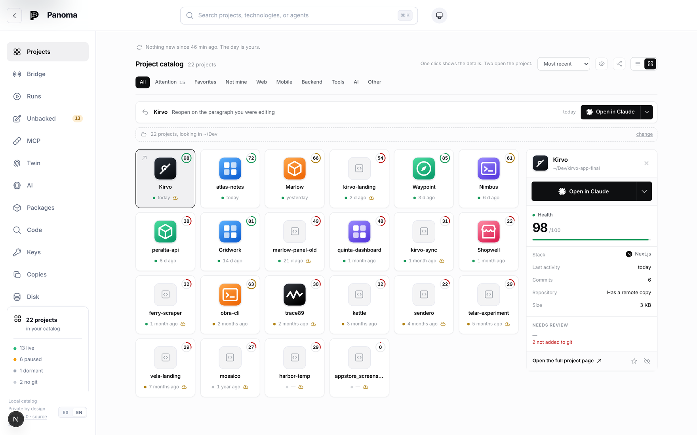

<div align="center">

[Leer en español](translations/README.es.md)

<picture>
  <source media="(prefers-color-scheme: dark)" srcset="docs/readme/logo-dark.png">
  
</picture>

# panoma

[](https://github.com/panomahq/panoma/actions/workflows/tests.yml)
[](LICENSE)
[](https://www.npmjs.com/package/panoma)

**The local catalog of your projects.** Everything you built—even what you never pushed—
ready to pick up again, by you or your agents.


<em>One command, no install and no upload—and every project on disk comes back with a face,
a name, and a pulse.</em>

</div>

---

## The same disk, twice

<div align="center">
  
  <br>
  <em>What the disk gives you. Every folder was a decision at some point.</em>
  <br><br>
  
  <br>
  <em>What panoma makes from it. The same folders, the same disk, and no upload.</em>
</div>

---

`panoma` is a **local project catalog**—think of it as the App Store for your own projects.
Give it a folder and it returns a page for everything living on your disk: stack,
dependencies, health, distribution targets, unbacked work, and which AI agent touched what.
Platforms built control towers that see only their own aircraft; panoma sees the whole sky:
your disk.

The architecture, design decisions, and known limits of each part are summarized below and
indexed under [`docs/`](docs/README.md). The business plan is intentionally absent: this
repository contains the product, not the spreadsheet.

## Status

**Local and working end to end**—engine, catalog, web app, CLI, MCP server, and proposal
dispatch.

- [x] Detection engine for npm, pub/Flutter, PyPI, Go, Cargo, RubyGems, and Composer
- [x] 83 technology-identification rules with evidence trails
- [x] Language statistics, icon detection, and distribution targets
- [x] Health score
- [x] AI-agent attribution through git trailers
- [x] Detection of duplicate families for the same project
- [x] `panoma scan` CLI
- [x] PostgreSQL schema through Drizzle and ingestion API
- [x] App Store-style web interface
- [x] Latest versions from seven public registries
- [x] Vulnerabilities through OSV.dev
- [x] MCP server with context, journal, and project task queue for agents
- [x] Dispatch of verified update proposals in isolation
- [x] Unbacked work: uncommitted, unpushed, no remote, or no repository
- [x] Disk usage and how much can be regenerated with a command
- [x] Code search across every project at once
- [x] Committed credentials in tracked files; full-history search remains pending
- [x] Resources and assets that no source file references
- [x] How each project starts, which runtime it needs, and which variables are missing
- [x] Command palette through ⌘K
- [x] Real project descriptions with template text removed
- [x] Origin classification: owned, forked, cloned, or generated from a template
- [x] Descriptions written by the model you connect, labeled as such
- [x] A watcher that discovers new projects and reanalyzes changed ones
- [x] A daily brief covering changes since your last visit and the agent behind each commit
- [x] Spanish and English interface with ES·EN selector, cookie, and `Accept-Language` ([docs/i18n.md](docs/i18n.md))
- [x] Credentialed mobile access through `panoma up --network` ([docs/network-access.md](docs/network-access.md))
- [x] A hardened agent channel: every door guarded, keys stored with mode 0600, and untrusted text unable to escape its data boundary ([docs/mcp-security.md](docs/mcp-security.md))
- [x] Agent instruction files: linting against the real disk, a self-managed block, attribution, inherited files, and model review ([docs/agents-md.md](docs/agents-md.md))
- [x] Curated project memory: agents propose durable facts, you approve them, and approved memory reaches every agent's first turn under a budget that refuses silent compaction ([docs/memory.md](docs/memory.md))
- [ ] Execution in an ephemeral container or CI; today it uses a local git worktree
- [ ] Notifications
- [ ] Maven/Gradle and NuGet through Syft

One line does not move: everything described here—the engine, CLI, catalog, agent channel,
and memory—is free software and will remain so. A future hosted cloud may be a separate
commercial service built on this code, never a wall in front of it. Keeping the free version
free is a contractual obligation under section 4 of the [CLA](CLA.md), not a blog promise.

## Try it

No installation and no account. It analyzes the folder and prints which project lives where,
how each one starts, how many commits exist only on this disk, and which agents touched each
project. Your code never leaves your machine.

```bash
npx panoma scan ~/Desktop
```

## Build from source

You need **Node.js 22 or newer** and **pnpm**. Version 22 is the floor because CI actually
tests it; the matrix runs version 22 and the newest supported release on all three operating
systems.

```bash
pnpm install
pnpm --filter "./packages/*" build
```

Start the web catalog:

```bash
pnpm --filter @panoma/web run dev
```

Fill it while the web app is running:

```bash
pnpm exec tsx apps/cli/src/index.ts scan ~/Desktop --save
```

Fetch current releases and security advisories:

```bash
pnpm exec tsx apps/cli/src/index.ts enrich
```

Open http://localhost:4173.

The first scan is the only manual one. From then on, the **watcher** keeps the catalog up to
date. It watches each project—manifests, lockfiles, `.env`, and git HEAD—plus the folders that
contain them. A `git clone` or `flutter create` beside existing projects joins the catalog
automatically, and a commit reanalyzes its project. The watcher is non-recursive and does not
use the network. Its state is available at `/api/watch`; set `PANOMA_WATCH=0` to disable it.

The watcher wakes lazily whenever anyone opens panoma, catches up with changes made while it
was stopped, checks itself every five minutes, and refreshes versions and advisories every
twelve hours without requiring an `enrich` command.

### The daily brief

The first thing panoma shows is **what changed since the last visit**: new commits with agent
attribution from the `Co-Authored-By` trailer, completed proposals waiting for a decision,
and projects that joined automatically. Health, stack, and dependencies are deliberately
absent; they change over weeks and already have dedicated pages.

The window is sticky. Refreshing does not empty the brief—it remains stable for half an
hour—and returning from vacation does not dump weeks of history at once; the window is
capped at fourteen days.

### Four questions only a catalog can answer

A tool that sees one project at a time cannot answer these questions because each depends on
the whole portfolio:

```bash
pnpm exec tsx apps/cli/src/index.ts disk               # disk used and how much returns automatically
pnpm exec tsx apps/cli/src/index.ts search "stripe"    # where did I write that?
pnpm exec tsx apps/cli/src/index.ts secrets            # which repositories contain committed keys?
pnpm exec tsx apps/cli/src/index.ts describe cabeman   # ask the model what this project is about
```

All four require the web app because the server owns database writes. `describe` also needs a
connected model through `panoma ai`. `secrets` exits nonzero when it finds something, making
it useful in a git hook or CI.

On the reference portfolio with 81 projects: 48.7 GB regenerable out of 56.7 GB total,
committed credentials found in 14 projects with 55 findings, and unbacked work found in 56
projects—23 of them not under version control at all.

### Propose an update

```bash
pnpm exec tsx apps/cli/src/index.ts run <project> <package>
```

Panoma isolates the project in a `git worktree`, edits the manifest, installs, runs the
tests, and leaves a branch with the patch. **It does not apply the change to your folder,
push, or open a pull request.** If the project has no tests, the proposal is marked
*unverified* instead of being presented as correct.

### Connect an agent

```bash
pnpm exec tsx apps/cli/src/index.ts agent-key "Claude Code"
```

The command prints the key and an MCP block ready to paste. With `--install`, it writes the
configuration to the file that agent actually reads—project `.mcp.json` for Claude Code and
`.cursor/mcp.json` for Cursor. For Codex it merges the `[mcp_servers.panoma]` table into
`~/.codex/config.toml` in place. When it cannot promise to leave the rest of that file
untouched it says so and writes nothing. In the application, the same action is available
under **Agents → Connect**.

The file contains the key in plain text, so panoma writes it with mode 0600 and warns if git
would track it. [docs/mcp-security.md](docs/mcp-security.md) explains what each door protects
and what no door protects.

Restart the agent afterwards. It then receives nine tools:

| Tool | Purpose |
|---|---|
| `panoma_context` | The brief: stack, outdated dependencies, vulnerabilities, tasks, and what other agents did |
| `panoma_log` | Record a change, decision, or blocker |
| `panoma_remember` | **Propose** a durable fact for project memory. Nobody receives it until you approve it |
| `panoma_recall` | Search the complete journal rather than only the recent window |
| `panoma_ask` | Leave a judgment question for your twin instead of interrupting you |
| `panoma_tasks` | See the project's open and closed task queue |
| `panoma_create_task` | Record technical debt without leaving the current task |
| `panoma_claim_task` | Claim work without colliding with another agent |
| `panoma_complete_task` | Close a task and explain how it was completed |

The full contract is documented in [docs/agent-channel.md](docs/agent-channel.md).

Analyze one project:

```bash
pnpm exec tsx apps/cli/src/index.ts scan .
```

Find and analyze everything below a folder:

```bash
pnpm exec tsx apps/cli/src/index.ts scan ~/Desktop
```

Show the full page, dependencies, and health breakdown:

```bash
pnpm exec tsx apps/cli/src/index.ts scan ~/my-project -v
```

Find copies of the same project and identify the live one:

```bash
pnpm exec tsx apps/cli/src/index.ts scan ~/Desktop -d
```

Export the complete portfolio as JSON:

```bash
pnpm exec tsx apps/cli/src/index.ts scan ~/Desktop --json --out portfolio.json
```

## Structure

```
packages/core/     detection engine (pure TypeScript, no network)
  discover.ts      walks the tree, honors .gitignore, finds project roots
  ecosystems/      manifest and lockfile parsers by ecosystem
  rules.ts         declarative technology-identification rules
  fingerprint.ts   rule evaluator with confidence accumulation
  languages.ts     language share by bytes
  icon.ts          application icon discovery
  health.ts        health score from 0 to 100
  git.ts           git metadata, agent attribution, and unbacked work
  duplicates.ts    groups copies of the same project
  links.ts         dashboard links for every service the project uses
  runbook.ts       installation, start command, and runtime requirements
  assets.ts        resources no source file references
  disk.ts          disk usage and what a command can regenerate
  secrets.ts       committed credentials in git-tracked files
  analyze.ts       pipeline orchestrator

packages/db/       PostgreSQL schema through Drizzle, ingestion, and queries
  schema.ts        tables, append-only snapshots, deterministic identifiers
  ingest.ts        idempotent scan ingestion
  queries.ts       catalog reads
  client.ts        PGlite locally, postgres-js with DATABASE_URL

packages/enrich/   data that requires the network
  registries.ts    npm, pub, PyPI, crates.io, Go, RubyGems, Packagist
  osv.ts           vulnerabilities from OSV.dev
  versions.ts      version comparison tolerant across ecosystems
  refresh.ts       orchestration and health recalculation

packages/runner/   bounded task dispatcher
  worktree.ts      isolation through git worktree
  detect.ts        how this project installs and tests
  recipes/bump.ts  targeted manifest edits that preserve formatting
  execute.ts       edit → install → verify → propose

packages/ai/       model connections
  providers.ts     providers through direct keys or installed terminal agents
  credentials.ts   atomic writes to ~/.panoma/ai.json with mode 0600
  cli-agent.ts     communicate with an installed terminal agent
  complete.ts      model call with budget and timeout

packages/mcp/      MCP server—the bridge to agents
  client.ts        catalog HTTP client and project detection
  format.ts        responses written for model consumption
  index.ts         definitions for the nine tools

apps/cli/          CLI: scan, enrich, disk, search, secrets, run, ai
apps/web/          local-only web catalog through Next.js 15; never deployed
apps/site/         public landing page and /docs through Next.js 15
```

## Design principles

**The engine does not use the network.** Anything that needs the internet—current releases,
OSV advisories—is added *on top of* `ProjectAnalysis`, never inside it. That keeps analysis
fast, deterministic, and straightforward to test.

**Your code is never uploaded.** Scanning is local and produces metadata only. This is a
product promise rather than an implementation detail; without it, nobody should point the
tool at private repositories.

**Every detection stores its evidence.** When the engine says "this is Flutter," it can say
why: `flutter` in `pubspec.yaml`, weight 0.7. When it is wrong, the user can see the reason
and correct it.

**The web app is the sole database owner.** The CLI never writes directly; it sends analysis
to `/api/ingest`. PGlite supports one process, and two writers corrupt its data directory—
this happened twice. [docs/broken-catalog.md](docs/broken-catalog.md) explains detection and
recovery. This is also the correct remote architecture: database credentials should never
live on every user's machine.

**The same SQL runs locally and remotely.** Without `DATABASE_URL`, panoma uses PGlite—
PostgreSQL compiled to WebAssembly, with no Docker or server. With `DATABASE_URL`, it uses
Supabase. The dialect and queries stay the same; only the driver changes.

**State the isolation used for every execution.** A proposal verified inside a container
deserves more confidence than one verified on the host. Presenting them equally hides the
difference that matters, so each run stores and displays its isolation level, including the
lowest one.

**Aggregate rather than reimplement.** Panoma is not a vulnerability scanner, CI service, or
package manager. Its value is the unified portfolio view. Advisories come from OSV.dev and
versions from official registries; panoma crosses those facts with everything you built.

**A proposal, never an applied change.** The dispatcher ends with a branch and patch. It does
not touch your working tree, push, or open a pull request; publishing is a human decision
that requires inspecting the diff. There is one recipe today—bump a dependency—because it is
bounded, measurable through the project's own tests, and reversible.

**"Unverified" and "correct" are not synonyms.** If a project has no tests, the proposal
says so instead of presenting itself as verified. A verifier that approves what it could not
verify is useless.

**Context first, logging second.** `panoma_context` gives the agent something it did not have;
`panoma_log` is the price paid in return. Nobody installs a tool that only asks for reports,
and without installation there is no journal.

**Logging cannot depend on the agent's goodwill.** Git attribution through
`Co-Authored-By` trailers runs in parallel, works in any repository, applies retroactively,
and requires no installation. MCP adds depth; git guarantees coverage.

**An honest blank is better than invented data.** If a registry does not publish something—
advisory severity, an SDK dependency version—the value remains empty. Plausible but false
data is worse than none: `flutter: sdk: flutter` is not a pub.dev package, and looking it up
once returned an unrelated abandoned package with the same name.

## Proposal isolation

The worktree isolates **changes**: nothing touches your folder. Commands still run somewhere,
and a dependency `postinstall` runs with the permissions of whoever launched it. Panoma has
three levels, and every execution records which one it used:

| Level | Protects | Cost |
|---|---|---|
| `local` | Nothing beyond the changes | None |
| `hardened` *(default)* | Credentials and sensitive areas of the disk | Slower installations |
| `container` | The rest of the disk, network, processes, and resources | Requires Docker or Podman |

Measured with a script that behaves like a hostile `postinstall`, rather than assumed:

| | Secrets in environment | Reads `~/.ssh` | Sees the rest of the disk | Network during tests |
|---|---|---|---|---|
| `local` | **7** | yes | yes | yes |
| `hardened` | 0 | no | **yes** | yes |
| `container` | 0 | no | **no** | **no** |

The middle row is the surprising one: **`hardened` still lets a script read your other
projects.** It protects credentials, not files. Only the container mounts the worktree alone,
so the rest of the disk does not exist for the process.

Inside the container, installation has network access because package registries require it;
tests do not, because the network is disconnected first. A malicious `postinstall` still
runs with network access. The route closed here is exfiltration during tests.

### Use the `container` level

```bash
brew install colima docker
colima start --cpu 2 --memory 4 --disk 12
panoma run <project> <package> --isolation container
```

Worktrees live under `~/.panoma/work` instead of the system temporary directory because
macOS returns `/var/folders/...` from `os.tmpdir()`, and container virtual machines do not
mount it. A worktree there would be invisible inside the container.

If `container` is requested without an available runtime, panoma **falls back to `hardened`
and says why**. A silent fallback would label the execution with isolation it never had.

## Contributing

Issues and pull requests are welcome. The canonical English guide is
[`CONTRIBUTING.md`](CONTRIBUTING.md), with a
[Spanish translation](translations/CONTRIBUTING.es.md). It covers searching before starting,
finding the correct part, setting up the project, and providing review evidence. It also
explains the [Contributor License Agreement](CLA.md) required before a first contribution.

## License

**AGPL-3.0-only.** Copyright (C) 2026 Jesus Castillo. See the complete text in
[`LICENSE`](LICENSE).

This is the license that matches panoma's promise. The program reads the entire disk,
including `.env` files ignored by git, and says none of it leaves the machine. Closed source
would require trust; open source makes the promise verifiable. The AGPL network clause closes
the gap GPL would leave: anyone offering a modified panoma as a service must publish those
changes instead of keeping them private. The copyright holder may also license the same code
under other terms; that is why the [CLA](CLA.md) exists, and section 4 fixes what must always
remain in the commons.

The name **panoma** and its logo are not covered by that license. See
[`TRADEMARK.md`](TRADEMARK.md) — the short version is that you may always say your software
is *based on panoma*, and you may not call it *panoma*.

Third-party licenses bundled in the package are included in the generated
`THIRD-PARTY-NOTICES.md`.
