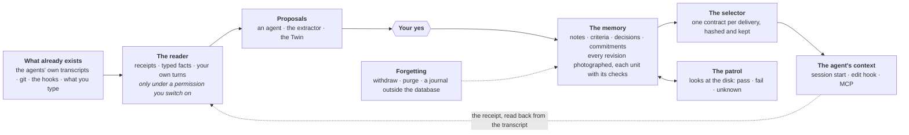

<div align="center">

[Leer en español](translations/README.es.md)

<picture>
  <source media="(prefers-color-scheme: dark)" srcset="docs/readme/logo-dark.png">
  
</picture>

# panoma

[](https://github.com/PanomaAI/panoma/actions/workflows/tests.yml)
[](LICENSE)
[](https://www.npmjs.com/package/panoma)

**The local catalog of your projects.** Everything you built—even what you never pushed—
ready to pick up again, by you or your agents.


<em>One command, no install and no upload—and every project on disk comes back with a face,
a name, and a pulse.</em>

</div>

---

## The same disk, twice

<div align="center">
  
  <br>
  <em>What the disk gives you. Every folder was a decision at some point.</em>
  <br><br>
  
  <br>
  <em>What panoma makes from it. The same folders, the same disk, and no upload.</em>
</div>

---

`panoma` is a **local project catalog**—think of it as the App Store for your own projects.
Give it a folder and it returns a page for everything living on your disk: stack,
dependencies, health, distribution targets, unbacked work, and which AI agent touched what.
Platforms built control towers that see only their own aircraft; panoma sees the whole sky:
your disk.

The architecture, design decisions, and known limits of each part are summarized below and
indexed under [`docs/`](docs/README.md). The business plan is intentionally absent: this
repository contains the product, not the spreadsheet.

## Status

**Local and working end to end**—engine, catalog, web app, CLI, MCP server, and proposal
dispatch.

- [x] Detection engine for npm, pub/Flutter, PyPI, Go, Cargo, RubyGems, and Composer
- [x] 83 technology-identification rules with evidence trails
- [x] Language statistics, icon detection, and distribution targets
- [x] Health score
- [x] AI-agent attribution through git trailers
- [x] Detection of duplicate families for the same project
- [x] `panoma scan` CLI
- [x] PostgreSQL schema through Drizzle and ingestion API
- [x] App Store-style web interface
- [x] Latest versions from seven public registries
- [x] Vulnerabilities through OSV.dev
- [x] MCP server with context, journal, and project task queue for agents
- [x] Dispatch of verified update proposals in isolation
- [x] Unbacked work: uncommitted, unpushed, no remote, or no repository
- [x] Disk usage and how much can be regenerated with a command
- [x] Code search across every project at once
- [x] Committed credentials in tracked files; full-history search remains pending
- [x] Resources and assets that no source file references
- [x] How each project starts, which runtime it needs, and which variables are missing
- [x] Command palette through ⌘K
- [x] Real project descriptions with template text removed
- [x] Origin classification: owned, forked, cloned, or generated from a template
- [x] Descriptions written by the model you connect, labeled as such
- [x] A watcher that discovers new projects and reanalyzes changed ones
- [x] A daily brief covering changes since your last visit and the agent behind each commit
- [x] Spanish and English interface with ES·EN selector, cookie, and `Accept-Language` ([docs/i18n.md](docs/i18n.md))
- [x] Credentialed mobile access through `panoma up --network` ([docs/network-access.md](docs/network-access.md))
- [x] A hardened agent channel: every door guarded, keys stored with mode 0600, and untrusted text unable to escape its data boundary ([docs/mcp-security.md](docs/mcp-security.md))
- [x] Agent instruction files: linting against the real disk, a self-managed block, attribution, inherited files, and model review ([docs/agents-md.md](docs/agents-md.md))
- [x] Curated project memory: agents propose durable facts, you approve them, and approved memory reaches every agent's first turn under a budget that refuses silent compaction ([docs/memory.md](docs/memory.md))
- [x] A memory contract: one selector over the whole archive, one offer per delivery with its hashes and its unit manifest, and a receipt read back from the agent's own transcript that says, unit by unit, what reached the context ([docs/memory-contract.md](docs/memory-contract.md))
- [x] Capture and extraction under three separate switches: typed facts of what the tools did, never a line of text; your own turns sent to the model in a window frozen before it is paid for; every paid call reserved in the ledger before it leaves ([docs/memory-capture.md](docs/memory-capture.md))
- [x] Checks with a purpose on every unit of the memory, a patrol that looks at the disk in the worker's free passes and answers pass, fail or unknown, incidents with your verdict on them, commitments only you or your criteria close, and typed conditions judged in three values ([docs/memory-checks.md](docs/memory-checks.md))
- [x] A Twin that learns on its own under a third switch, counts its support in cases rather than messages, and writes your taste file through an outbox that compares before writing and reads back after ([docs/twin-learning.md](docs/twin-learning.md))
- [x] Forgetting that survives a backup — withdraw or purge, previewed first, journaled outside the database, with a quarantine when the two disagree — and a storage quota that pauses the machine and never the person
- [x] Optional official apps, with a screen of their own: a validated manifest, versions that activate and roll back, and each job in a separate process ([docs/apps.md](docs/apps.md))
- [x] panoma video, the first app: it adds a production screen to every project and a "Create video" button to the project header, installs from npm as [`@panoma/video`](https://www.npmjs.com/package/@panoma/video), and an agent holding a key can ask for a production of the project it is in through the `panoma_video` MCP tools — with the model and the voice you switched on, never ones it chose
- [x] A spend screen: every model call is recorded, with a daily cap for each of the nine budget families that you can raise, lower, set to zero to switch that family off, or leave at the factory value ([docs/budgets.md](docs/budgets.md))
- [x] A bridge screen: the four setup steps between your projects and your agents—catalog, model, agent, and automatic logging—one at a time, kept apart from what the agents have already recorded
- [x] Execution inside an ephemeral container through docker, podman, nerdctl, or finch, falling back to the hardened level and saying why when no runtime is installed ([docs/run-and-isolation.md](docs/run-and-isolation.md))
- [x] Handoff: continue a conversation in another agent, or in the same one after signing in, with `panoma handoff`, the `/handoff` screen, or—when you ask it to—the agent itself through the `panoma_conversations` and `panoma_handoff` MCP tools; panoma writes a new conversation into the target agent's own history so its normal resume finds it, the original is never touched, and the receipt says what travelled, what stayed behind, and who asked ([docs/handoff.md](docs/handoff.md))
- [ ] Execution in CI
- [ ] Notifications
- [ ] Maven/Gradle and NuGet through Syft

One line does not move: everything described here—the engine, CLI, catalog, agent channel,
and memory—is free software and will remain so. A future hosted cloud may be a separate
commercial service built on this code, never a wall in front of it. Keeping the free version
free is a contractual obligation under section 4 of the [CLA](CLA.md), not a blog promise.

## Try it

No installation and no account. It analyzes the folder and prints which project lives where,
how each one starts, how many commits exist only on this disk, and which agents touched each
project. Your code never leaves your machine.

```bash
npx panoma scan ~/Desktop
```

## Build from source

You need **Node.js 22 or newer** and **pnpm**. Version 22 is the floor because CI actually
tests it: every push runs Node 22 and 26 on Linux, Windows runs once a week and on demand,
and macOS only when the dispatch asks for it.

```bash
pnpm install
pnpm --filter "./packages/*" build
```

Start the web catalog:

```bash
pnpm --filter @panoma/web run dev
```

Fill it while the web app is running:

```bash
pnpm exec tsx apps/cli/src/index.ts scan ~/Desktop --save
```

Fetch current releases and security advisories:

```bash
pnpm exec tsx apps/cli/src/index.ts enrich
```

Open http://localhost:4173.

The first scan is the only manual one. From then on, the **watcher** keeps the catalog up to
date. It watches each project—manifests, lockfiles, `.env`, and git HEAD—plus the folders that
contain them. A `git clone` or `flutter create` beside existing projects joins the catalog
automatically, and a commit reanalyzes its project. The watcher is non-recursive and does not
use the network. Its state is available at `/api/watch`; set `PANOMA_WATCH=0` to disable it.

The watcher wakes lazily whenever anyone opens panoma, catches up with changes made while it
was stopped, checks itself every five minutes, and refreshes versions and advisories every
twelve hours without requiring an `enrich` command.

### The daily brief

The first thing panoma shows is **what changed since the last visit**: new commits with agent
attribution from the `Co-Authored-By` trailer, completed proposals waiting for a decision,
and projects that joined automatically. Health, stack, and dependencies are deliberately
absent; they change over weeks and already have dedicated pages.

The window is sticky. Refreshing does not empty the brief—it remains stable for half an
hour—and returning from vacation does not dump weeks of history at once; the window is
capped at fourteen days.

### Four questions only a catalog can answer

A tool that sees one project at a time cannot answer these questions because each depends on
the whole portfolio:

```bash
pnpm exec tsx apps/cli/src/index.ts disk               # disk used and how much returns automatically
pnpm exec tsx apps/cli/src/index.ts search "stripe"    # where did I write that?
pnpm exec tsx apps/cli/src/index.ts secrets            # which repositories contain committed keys?
pnpm exec tsx apps/cli/src/index.ts describe kestrel   # ask the model what this project is about
```

All four require the web app because the server owns database writes. `describe` also needs a
connected model through `panoma ai`. `secrets` exits nonzero when it finds something, making
it useful in a git hook or CI.

On the reference portfolio with 81 projects: 48.7 GB regenerable out of 56.7 GB total,
committed credentials found in 14 projects with 55 findings, and unbacked work found in 56
projects—23 of them not under version control at all.

### Propose an update

```bash
pnpm exec tsx apps/cli/src/index.ts run <project> <package>
```

Panoma isolates the project in a `git worktree`, edits the manifest, installs, runs the
tests, and leaves a branch with the patch. **It does not apply the change to your folder,
push, or open a pull request.** If the project has no tests, the proposal is marked
*unverified* instead of being presented as correct.

### Connect an agent

```bash
pnpm exec tsx apps/cli/src/index.ts agent-key "Claude Code"
```

The command prints the key and an MCP block ready to paste. With `--install`, it writes the
configuration to the file that agent actually reads—project `.mcp.json` for Claude Code,
`.cursor/mcp.json` for Cursor, and `~/.gemini/settings.json` for Gemini CLI. For Codex it
merges the `[mcp_servers.panoma]` table into
`~/.codex/config.toml` in place. When it cannot promise to leave the rest of that file
untouched it says so and writes nothing. In the application, the same action is available
under **Agents → Connect**.

The file contains the key in plain text, so panoma writes it with mode 0600 and warns if git
would track it. [docs/mcp-security.md](docs/mcp-security.md) explains what each door protects
and what no door protects.

Restart the agent afterwards. It then receives fifteen tools:

| Tool | Purpose |
|---|---|
| `panoma_context` | The brief: stack, outdated dependencies, vulnerabilities, tasks, and what other agents did. With `files`, the rules pinned to those paths; with `task`, the rules and decisions whose words overlap what you are about to do. With `memoryVersion: 2`, the memory contract: every unit whole, what remains to be checked, what did not fit and why, and a continuation for the rest |
| `panoma_log` | Record a change, decision, or blocker |
| `panoma_remember` | **Propose** a durable fact for project memory. Nobody receives it until you approve it |
| `panoma_recall` | Search the complete journal page by page, and read any entry whole. With `memoryKind` and `memoryId`, read one unit of the memory whole — a note, a criterion, a decision, a commitment or a task's case — at the revision asked for |
| `panoma_ask` | Leave a judgment question for your twin instead of interrupting you |
| `panoma_tasks` | See the project's open and closed task queue |
| `panoma_create_task` | Record technical debt without leaving the current task |
| `panoma_claim_task` | Claim work without colliding with another agent |
| `panoma_complete_task` | Close a task and explain how it was completed |
| `panoma_conversations` | The conversations kept for this project, newest first, and the receipts of what was already handed off. Read from the agents' own stores on this machine; nothing is ingested by looking |
| `panoma_handoff` | Continue this conversation in another agent, when you ask for it. The copy goes into that agent's own history with the mechanical digest; `dryRun` shows what would travel and writes nothing. The same agent is not a target on this channel |
| `panoma_apps` | The optional apps on this machine: installed version, readiness, each requirement, the model and voice you switched on, and your next step when one is not ready |
| `panoma_video` | Make a video of this project with panoma video, when you ask for one: a durable job in the agent's name, with the settings you confirmed on the app's page. Installing, enabling and switching a provider on stay yours |
| `panoma_video_jobs` | The project's productions, or one whole: its twelve stages, the cuts with their files on this machine, the kinds of video set aside and why, what it spent; `wait` holds until it moves |
| `panoma_video_cancel` | Stop a production of this project |

The full contract is documented in [docs/agent-channel.md](docs/agent-channel.md).

### Hand off a conversation

The usage limit hits, or the next step wants a different tool, and the conversation should go
on somewhere else. List what your agents kept on this disk, newest first:

```bash
pnpm exec tsx apps/cli/src/index.ts handoff
```

Continue the newest conversation in this folder in Codex. Panoma writes it into Codex's own
history with a fresh id, so `codex resume` finds it as one of its own; the original is never
touched:

```bash
pnpm exec tsx apps/cli/src/index.ts handoff --to codex
```

Send the digest and the newest turns instead of every one, for a conversation that is large:

```bash
pnpm exec tsx apps/cli/src/index.ts handoff --to claude --tier compact
```

Let the connected model write the digest, reading the whole conversation in windows:

```bash
pnpm exec tsx apps/cli/src/index.ts handoff --to claude --tier compact --digest model
```

See what would travel and what would stay, with the counts, and write nothing:

```bash
pnpm exec tsx apps/cli/src/index.ts handoff --to opencode --dry-run
```

Take it to another machine as a portable file, outside every agent's store:

```bash
pnpm exec tsx apps/cli/src/index.ts handoff --to bundle --out conversation.json
```

Claude Code, Codex CLI, OpenCode, and Gemini CLI resume the copy themselves; Claude (app) and
Codex (app) open it through a link on macOS; Cursor, Copilot, Aider, Amp, and Goose get a
document to paste. Thinking blocks, images, and subagent runs never travel, secrets are masked,
and every count is shown before anything is written. The `/handoff` screen does the same
behind the operator key, and an agent holding a key can do it for the project it is in through
`panoma_conversations` and `panoma_handoff`, with a mechanical digest only and never to the
same agent. The same agent, with the account you want to continue with, writes nothing at
`full`: every store is per machine and per folder, never per account, so panoma prints your own
sign-out, sign-in, and resume steps and runs none of them; at `compact` it writes a shorter
copy in the same store.

`full` is the whole transcript: a conversation the agent compacted keeps every turn, with each
of its summaries where it was made, and the target's own model restarts from the newest one
as the source's did. `compact` is Panoma's own compaction. Its digest is mechanical and free
—goal, the source's newest summary, decisions, files, commands, open items, the last
exchange— unless you let the connected model write it: then the model reads the whole
conversation in windows of 60,000 characters, oldest to newest, one call each, and the last
answer is the summary. A source with a readable summary of its own (Claude Code, OpenCode) is
read from that summary on: the last compaction and what followed. Codex's summaries are
encrypted, so a Codex source is read whole. The calls are counted before anything is paid;
the screen and the terminal say how many, what each tier weighs in tokens, and preselect
`compact` over 150,000 of them. The box starts ticked only when the source carries no
summary Panoma can read, a model is connected and the chain fits today's cap; with no model
connected the screen says what travels instead and links to where one is connected.
[docs/handoff.md](docs/handoff.md) has the decision, the versions each store was verified
against, and what never crosses the line.

Analyze one project:

```bash
pnpm exec tsx apps/cli/src/index.ts scan .
```

Find and analyze everything below a folder:

```bash
pnpm exec tsx apps/cli/src/index.ts scan ~/Desktop
```

Show the full page, dependencies, and health breakdown:

```bash
pnpm exec tsx apps/cli/src/index.ts scan ~/my-project -v
```

Find copies of the same project and identify the live one:

```bash
pnpm exec tsx apps/cli/src/index.ts scan ~/Desktop -d
```

Export the complete portfolio as JSON:

```bash
pnpm exec tsx apps/cli/src/index.ts scan ~/Desktop --json --out portfolio.json
```

## The memory

panoma's memory is not a chat log. It sits beside the disk, so it can notice on its own when
something it remembers stops being true; nothing enters it without your yes; and every byte
it hands an agent is written down before it leaves the process and read back afterwards from
the agent's own record. This section tells the whole loop. The decision records behind each
part are [docs/memory.md](docs/memory.md), [docs/memory-contract.md](docs/memory-contract.md),
[docs/memory-capture.md](docs/memory-capture.md), [docs/memory-checks.md](docs/memory-checks.md)
and [docs/twin-learning.md](docs/twin-learning.md). Prefer it told step by step, from one
sentence of yours to a rule every agent receives? [panoma.ai/memory](https://www.panoma.ai/memory)
tells it twice — plainly, and with the names and figures of the code — in English or Spanish.



### What is remembered

Four floors, and each one answers a different question:

| Floor | What it holds | Who writes it |
|---|---|---|
| **The journal** | Everything agents logged here, kept for good and searchable page by page. *What happened.* | The agents, through `panoma_log` and the hooks |
| **The curated memory** | Short, durable rules: a note of at most 500 characters, a criterion of your taste, a decision with its rationale, a commitment you took on. *What is still true.* | Proposed by anyone, approved only by you |
| **Sleeping notes** | A note with a *where* — an exact path or a zone such as `apps/web`. It costs nothing in the brief and wakes when an agent is about to touch that path. | The same gate |
| **Checks** | What the disk should look like for a rule to hold: a script that must exist, a literal that must not come back, a dependency that must be declared. | You, on any unit of the memory |

Every unit carries a **revision**, and every change photographs the row as it was, so a
delivery can say which revision travelled and a look can say which revision it looked at. A
note can be **superseded** by a rewrite that names it, or given a **valid until** day; nothing
expires by itself and nothing is edited in place.

### Nothing is served without your yes

Agents can only propose. An agent proposes a fact with `panoma_remember`; the extractor
proposes from your own messages; the Twin proposes a criterion from what you told your agents.
All of it lands in the same queue, capped at 20 so that reviewing never becomes a chore nobody
does, and approving or discarding lives behind a screen action, never behind an agent key. An
approved note is shown to every agent that opens the project, so a poisoned memory would be a
virus with a loudspeaker; the review is the antivirus.

The memory is **small on purpose**: 2,000 characters of awake memory per project, 30 sleeping
notes, 3,000 characters in the portrait of your taste. Because the whole of it fits in front
of the model there is no retrieval step that can pick the wrong memory, and when it fills up
nothing is summarized away behind your back — you are told, and you decide what goes. On top
of the character budgets there is a **storage quota** for everything the machine derives on
its own — photographs, offers, facts, staged answers —: 256 MiB per catalog and 64 MiB per
project out of the box. A full quota pauses the machine, never the person: what you approve or
write by hand is always taken, and nothing is deleted to make room.

### What an agent receives is a contract

Before delivery A there were three readers with three universes and no receipt: what a session
got depended on which road it came in by. Now there is **one selector** over the whole eligible
archive and **one contract** per delivery, `MemoryContractV2`:

- **`items`** — every unit that travelled, whole: its kind, revision, scope, authority, the
  text and its rationale, its conditions and exceptions. A unit is indivisible: a rule travels
  with its exceptions or it does not travel.
- **`checks`** — what panoma could not resolve, as text, so the agent knows what remains to be
  checked before acting.
- **`omissions`** and a **`manifest`** — what did not fit, by reason and count, readable whole
  by id. A required unit is never dropped to make room for an optional one; if the core alone
  does not fit, the contract says `incomplete` instead of pretending.
- **A status** — `ready`, `requires_check`, `conflict`, `incomplete` or `unavailable`. Two
  active decisions of one family are withheld as a `conflict` rather than resolved by picking
  the newer one.

The selector's order is the decision: eligibility first, then the core whole and unranked
(awake notes, published criteria, the sleeping notes a touched path triggers), then a lexical
search over the whole archive — a decision recorded behind 250 newer ones is found by its
words —, then the limits, never the limits first. Every delivery is an **offer** written down
before its bytes leave the process, with the SHA-256 of its payload and of the exact text
emitted, and a manifest of the byte range of each unit inside that text.

The contract reaches the agent by three roads: the `SessionStart` hook prints it into a new
Claude Code context at startup, resume, clear and compaction; the edit hook delivers the
sleeping notes of the path being touched; and `panoma_context` carries it over MCP. Each road
has a measured limit — 6,500 code points and 24 KiB for the brief, 24 KiB for MCP — counted on
the message the program receives, never called tokens.

### The receipt

An offer proves what panoma prepared; it does not prove that anything arrived. With the
capture switch on, a reader opens the agent's own transcript — read only, never modified — and
looks for those exact bytes at the one site that seals a reception: the record the agent
writes for the hook's output, in the session the offer was bound to. It then writes what it
found, unit by unit: `full`, `partial`, `unknown` or `not_observed`. The same bytes in a prompt,
in a tool result or in a README are never a reception; on a host nobody has verified, the
reception is `unknown` and never `full`. A context is counted per session and per generation:
a compaction or a `/clear` empties it and the next brief is a new contract, so a rule is never
suppressed because a context that no longer exists once saw it.

The catalog keeps a **capability matrix** per host, filled from three separate pieces of
evidence — a hook was installed, an invocation was observed, a receipt site was verified by a
person reading the record — and a host outside it gets `unknown` on every axis. Verified today:
Claude Code 2.1.258 from the desktop app. What is not verified is declared, never counted.

### Reading the transcripts, under three switches

Each agent history on the disk is a source, and nothing in it is opened until you allow that
source by name on the Twin screen. On top of that base permission there are three **grants**,
each with a purpose, a scope — one project or all — and a boundary inside every file:

1. **Capture.** At its first notice the reader takes only the receipts and the lifecycle
   records. At the second — an explicit re-consent — it also keeps **typed facts** of what the
   tools did, with coordinates and never a line of text: `read`, `edit`, `command`,
   `test_result`, `failure`, `commit`, `lifecycle`, `receipt_seen`.
2. **Extraction.** Your own turns of the allowed range — redacted, bounded, never the
   assistant's words — go to the model you connected, with the facts, in a **window frozen
   before it is paid for**: when the conversation has been quiet for thirty minutes, or the
   pending bytes pass 96 KiB, or the oldest of them is four hours old. What comes back is a
   proposal with the quotes that support it, waiting for your yes like everything else.
3. **Twin learning.** The same turns, distilled into observations about your taste in the
   background, told below.

The boundary is what makes the permission honest: a stream older than the grant starts at the
size it had when first seen, a record cut in half at the boundary is excluded whole, and a
grant switched off and on again resumes at the new boundary and never behind it. Every paid
call is **reserved** in the ledger before it leaves, under the daily cap of its family, so two
organs can never both spend the last call of the day.

### Checks: what the disk may say about a rule

A check is `{ purpose, kind, target, expected }` on a note, a criterion, a decision or a
commitment. The **purpose** decides what a failure does:

| Purpose | What the check is | What a `fail` does |
|---|---|---|
| `grounds` | the foundation the rule stands on | a note is challenged and stops being served; a decision or a criterion gets an incident and stays — a rule is never retired by a scanner |
| `applicability` | where the unit applies | an observation; the selector leaves the unit out where it does not apply |
| `violation` | what a rule in force forbids | an incident; the rule stays exactly as it is |
| `completion` | the finishing line of a commitment | an observation while it is open — a fail never closes an obligation |

Seven **kinds**, all of them read and none of them run: `path_exists`, `file_hash`,
`text_present`, `text_absent`, `manifest_script`, `direct_dependency`, `structured_key`. The
evaluator answers `pass`, `fail` or `unknown` with a reason, and `unknown` is never a `fail`: a
file it cannot read challenges nothing. The **patrol** looks in the worker's free passes, two
seconds per project and turn, outside every delivery — no hook ever waits for it — and writes
one **observation** per look with the exact state of the disk it saw: HEAD, dirty or clean,
the hash of each file inspected. An observation is stale after ten minutes and asks for
another look; it never turns a rule on or off. An **incident** is an identity with your verdict
on it, `confirmed` or `false_positive`, and never a judgement of obedience: whether the rule
had reached the agent before is answered `yes` only when a `full` receipt of that revision
precedes the look in the same context, and `unknown` otherwise.

### Commitments and cases

A **commitment** is an obligation with a version: a text, optional typed conditions, up to six
completion criteria. Only two actors close it — you, or every completion criterion passing on
the current revision, fresh, in one environment. An agent saying «done» is a report and closes
nothing. A closed commitment is never reopened; what continues it is a new one linked to the
old. A **case** is a projection of a task and never a row: what was asked, what was decided,
what the agent declared and what the checks saw, in four separate columns, with `unknown`
where nothing was recorded — no story is written between them.

### Conditions in three values

A decision, a criterion or a commitment may carry a typed predicate beside its narrative: a
tree of `all`, `any` and `not` over six leaves — `project_is`, `path_under`, `operation_is`,
`environment_is`, `task_kind_is`, `check_result_is`. The selector judges it over the facts the
request can honestly declare and the last fresh observation of each check consulted: true and
it is served; false and it is left out whole as `not_applicable`; undecidable and it travels
`conditional`, with one `requires_check` line per fact that would settle it. The sentences go
inside the unit — `Applies when: …` and `Except when: …` — on every road, in the brief and in
`TASTE.md` alike, so the screen, the brief and the file read one sentence for one tree.

### The Twin learns on its own

The third switch, on top of capture, lets the worker distil your new turns into observations
of the Twin in the background, one paid stage at a time inside the same daily cap: observations
with the exact quote and its origin, a topic for the ones that had none, a synthesis of each
topic whose inputs moved. A topic is re-synthesized only when the evidence behind it changed,
so the cycle never feeds itself. Support is counted in **cases** — the origin of a quote, so
the same session copied into two windows is one case — and an inference publishes on its own
only with three families of known origin behind it. Learning and publishing are two acts: what
it infers waits in the Twin until you have said, once, that inferences may reach `TASTE.md`,
and every write of that file goes through an **outbox** that compares the file before writing
and reads it back after. A line you delete in the file is a veto; a line you rewrite is your
signature on those words; and both are heard before any criterion is served again.

### Forgetting that survives a backup

Two doors, one protocol: a **withdrawal** takes eligibility away and keeps the bytes; a
**purge** blanks the copies as well — photographs, offers, a stream's locator — and keeps the
coordinates, so the receipt can still say what was cleaned. Both preview first, with the seven
counts they would reach and what would be retained, and confirm only through the door that
previewed. Every operation is appended, fsync'd, to a journal outside the database before its
row exists: a copy restored from before a purge finds a journal it does not carry and the
memory goes into **quarantine** — every delivery answers `unavailable` until a person
reconciles — instead of bringing the text back in silence.

### Turn it on

```bash
panoma agent-key "Claude Code" --install   # the key and the MCP block: the tools, the brief and the memory
panoma hooks --install                      # the lifecycle hooks: the brief at session start, the receipt pointer at its end
panoma memory allow claude-code capture --all --notice 2   # receipts and typed facts, on every project
panoma memory allow claude-code extract --project kestrel  # your own turns, to the model, for one project
panoma memory allow claude-code twin --all                 # the Twin learns on its own
panoma memory status                        # offers, receipts, cursors, which hosts are verified
```

Each grant is a switch on the Twin screen too, with the sentence that says what is read, from
which byte and how to take it back. `panoma memory revoke` takes one back and says what stops
with it; `panoma memory withdraw` and `panoma memory purge` are the two doors above.

## Structure

```
packages/core/     detection engine (pure TypeScript, no network)
  discover.ts      walks the tree, honors .gitignore, finds project roots
  ecosystems/      manifest and lockfile parsers by ecosystem
  rules.ts         declarative technology-identification rules
  fingerprint.ts   rule evaluator with confidence accumulation
  languages.ts     language share by bytes
  icon.ts          application icon discovery
  health.ts        health score from 0 to 100
  git.ts           git metadata, agent attribution, and unbacked work
  duplicates.ts    groups copies of the same project
  links.ts         dashboard links for every service the project uses
  runbook.ts       installation, start command, and runtime requirements
  assets.ts        resources no source file references
  disk.ts          disk usage and what a command can regenerate
  secrets.ts       committed credentials in git-tracked files
  analyze.ts       pipeline orchestrator
  memory-contract.ts  the memory contract: vocabulary, canonical hashes, rendering, reception check
  predicates.ts    typed conditions in three values: six leaves under all, any and not
  checks-eval.ts   the pure evaluator of a check: pass, fail or unknown, and nothing run
  cases.ts         a task's case as a projection: asked, decided, declared, checked
  history/         the readers of the agents' own transcripts: receipts, typed facts, the owner's turns

packages/db/       PostgreSQL schema through Drizzle, ingestion, and queries
  schema.ts        tables, append-only snapshots, deterministic identifiers
  ingest.ts        idempotent scan ingestion
  queries.ts       catalog reads
  client.ts        PGlite locally, postgres-js with DATABASE_URL
  notes.ts         the curated memory: proposals, the gate, succession, expiry, the caps
  memory-revisions.ts  every delivered object photographed at every revision
  memory-checks.ts · memory-outcomes.ts · commitments.ts  checks, observations, incidents, obligations
  memory-jobs.ts · model-reservations.ts  batch jobs with a lease, and the ledger row before every paid call
  memory-purge.ts · memory-usage.ts  withdraw and purge with their journal, and the storage quota

packages/enrich/   data that requires the network
  registries.ts    npm, pub, PyPI, crates.io, Go, RubyGems, Packagist
  osv.ts           vulnerabilities from OSV.dev
  versions.ts      version comparison tolerant across ecosystems
  refresh.ts       orchestration and health recalculation

packages/runner/   bounded task dispatcher
  worktree.ts      isolation through git worktree
  detect.ts        how this project installs and tests
  recipes/bump.ts  targeted manifest edits that preserve formatting
  execute.ts       edit → install → verify → propose

packages/ai/       model connections
  providers.ts     providers through direct keys or installed terminal agents
  credentials.ts   atomic writes to ~/.panoma/ai.json with mode 0600
  cli-agent.ts     communicate with an installed terminal agent
  complete.ts      model call with budget and timeout

packages/mcp/      MCP server—the bridge to agents
  client.ts        catalog HTTP client and project detection
  format.ts        responses written for model consumption
  index.ts         definitions for the fifteen tools

packages/handoff/  hands a conversation to another agent, and never touches the original
  stores/          the four stores, and the closed list of what may be opened under each
  discover.ts      lists the conversations in the agents' own stores; a large file by head and tail
  readers/         one per native store: Claude Code, Codex CLI, OpenCode, Gemini CLI
  writers/         one per native target, plus the Markdown document for the rest
  transfer.ts      handoff(): one conversation, one target, one tier, one new file
  digest.ts        the mechanical digest: title, goal, decisions, files, commands, open items
  compact.ts       the compact tier: the digest plus the newest turns whole
  fidelity.ts      what each target keeps and leaves, its resume line, and the app links
  bundle.ts        the portable file for another machine
  faults.ts        the closed list of refusals; the HTTP status of each lives in apps/web

packages/apps/     manager for the optional official apps
  manifest.ts      the app manifest as data, validated before activation
  official.ts      the apps this release is allowed to install
  registry.ts      the version published on npm, cached for a day
  manager.ts       install, activate, roll back, uninstall, probe requirements
  process.ts       finds npm and runs it without a shell, descendants included
  layout.ts        where each app and its work live under ~/.panoma
  environment.ts   the variables an app child inherits, and no others

apps/cli/          CLI: scan, enrich, disk, search, secrets, run, ai, handoff
apps/web/          local-only web catalog through Next.js 15; never deployed
apps/site/         public landing page and /docs through Next.js 15
```

## Design principles

**The engine does not use the network.** Anything that needs the internet—current releases,
OSV advisories—is added *on top of* `ProjectAnalysis`, never inside it. That keeps analysis
fast, deterministic, and straightforward to test.

**Your code is never uploaded.** Scanning is local and produces metadata only. This is a
product promise rather than an implementation detail; without it, nobody should point the
tool at private repositories.

**Every detection stores its evidence.** When the engine says "this is Flutter," it can say
why: `flutter` in `pubspec.yaml`, weight 0.7. When it is wrong, the user can see the reason
and correct it.

**The web app is the sole database owner.** The CLI never writes directly; it sends analysis
to `/api/ingest`. PGlite supports one process, and two writers corrupt its data directory—
this happened twice. [docs/broken-catalog.md](docs/broken-catalog.md) explains detection and
recovery. This is also the correct remote architecture: database credentials should never
live on every user's machine.

**The same SQL runs locally and remotely.** Without `DATABASE_URL`, panoma uses PGlite—
PostgreSQL compiled to WebAssembly, with no Docker or server. With `DATABASE_URL`, it uses
Supabase. The dialect and queries stay the same; only the driver changes.

**State the isolation used for every execution.** A proposal verified inside a container
deserves more confidence than one verified on the host. Presenting them equally hides the
difference that matters, so each run stores and displays its isolation level, including the
lowest one.

**Aggregate rather than reimplement.** Panoma is not a vulnerability scanner, CI service, or
package manager. Its value is the unified portfolio view. Advisories come from OSV.dev and
versions from official registries; panoma crosses those facts with everything you built.

**A proposal, never an applied change.** The dispatcher ends with a branch and patch. It does
not touch your working tree, push, or open a pull request; publishing is a human decision
that requires inspecting the diff. There is one recipe today—bump a dependency—because it is
bounded, measurable through the project's own tests, and reversible.

**"Unverified" and "correct" are not synonyms.** If a project has no tests, the proposal
says so instead of presenting itself as verified. A verifier that approves what it could not
verify is useless.

**Context first, logging second.** `panoma_context` gives the agent something it did not have;
`panoma_log` is the price paid in return. Nobody installs a tool that only asks for reports,
and without installation there is no journal.

**Logging cannot depend on the agent's goodwill.** Git attribution through
`Co-Authored-By` trailers runs in parallel, works in any repository, applies retroactively,
and requires no installation. MCP adds depth; git guarantees coverage.

**An honest blank is better than invented data.** If a registry does not publish something—
advisory severity, an SDK dependency version—the value remains empty. Plausible but false
data is worse than none: `flutter: sdk: flutter` is not a pub.dev package, and looking it up
once returned an unrelated abandoned package with the same name.

## Proposal isolation

The worktree isolates **changes**: nothing touches your folder. Commands still run somewhere,
and a dependency `postinstall` runs with the permissions of whoever launched it. Panoma has
three levels, and every execution records which one it used:

| Level | Protects | Cost |
|---|---|---|
| `local` | Nothing beyond the changes | None |
| `hardened` | Credentials and, on macOS, your home folder | Slower installations |
| `container` *(default when a runtime is installed)* | The rest of the disk, network, processes, and resources | Requires docker, podman, nerdctl, or finch |

Measured on macOS with a script that behaves like a hostile `postinstall`, rather than assumed.
`hardened` closes your home folder with `sandbox-exec`, which exists only there: on Linux and
Windows it stops at cleaning the environment, and it says so rather than promising the same
everywhere:

| | Secrets in environment | Reads `~/.ssh` | Sees the rest of the disk | Network during tests |
|---|---|---|---|---|
| `local` | **7** | yes | yes | yes |
| `hardened` | 0 | no | **yes** | yes |
| `container` | 0 | no | **no** | **no** |

The middle row is the surprising one: **`hardened` still lets a script read your other
projects.** It protects credentials, not files. Only the container mounts the worktree alone,
so the rest of the disk does not exist for the process.

Inside the container, installation has network access because package registries require it;
tests do not, because the network is disconnected first. A malicious `postinstall` still
runs with network access. The route closed here is exfiltration during tests.

### Use the `container` level

```bash
brew install colima docker
colima start --cpu 2 --memory 4 --disk 12
panoma run <project> <package> --isolation container
```

Worktrees live under `~/.panoma/work` instead of the system temporary directory because
macOS returns `/var/folders/...` from `os.tmpdir()`, and container virtual machines do not
mount it. A worktree there would be invisible inside the container.

If `container` is requested without an available runtime, panoma **falls back to `hardened`
and says why**. A silent fallback would label the execution with isolation it never had.

## Contributing

Issues and pull requests are welcome. The canonical English guide is
[`CONTRIBUTING.md`](CONTRIBUTING.md), with a
[Spanish translation](translations/CONTRIBUTING.es.md). It covers searching before starting,
finding the correct part, setting up the project, and providing review evidence. It also
explains the [Contributor License Agreement](CLA.md) required before a first contribution.

## License

**AGPL-3.0-only.** Copyright (C) 2026 Jesus Castillo. See the complete text in
[`LICENSE`](LICENSE).

This is the license that matches panoma's promise. The program reads the entire disk,
including `.env` files ignored by git, and says none of it leaves the machine. Closed source
would require trust; open source makes the promise verifiable. The AGPL network clause closes
the gap GPL would leave: anyone offering a modified panoma as a service must publish those
changes instead of keeping them private. The copyright holder may also license the same code
under other terms; that is why the [CLA](CLA.md) exists, and section 4 fixes what must always
remain in the commons.

The name **panoma** and its logo are not covered by that license. See
[`TRADEMARK.md`](TRADEMARK.md) — the short version is that you may always say your software
is *based on panoma*, and you may not call it *panoma*.

Third-party licenses bundled in the package are included in the generated
`THIRD-PARTY-NOTICES.md`.
