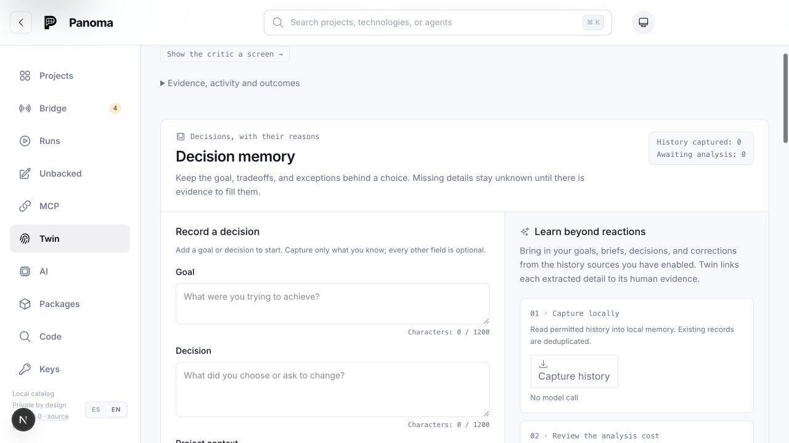
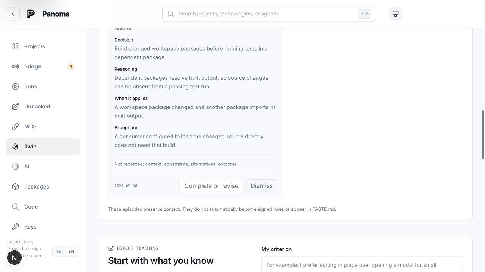
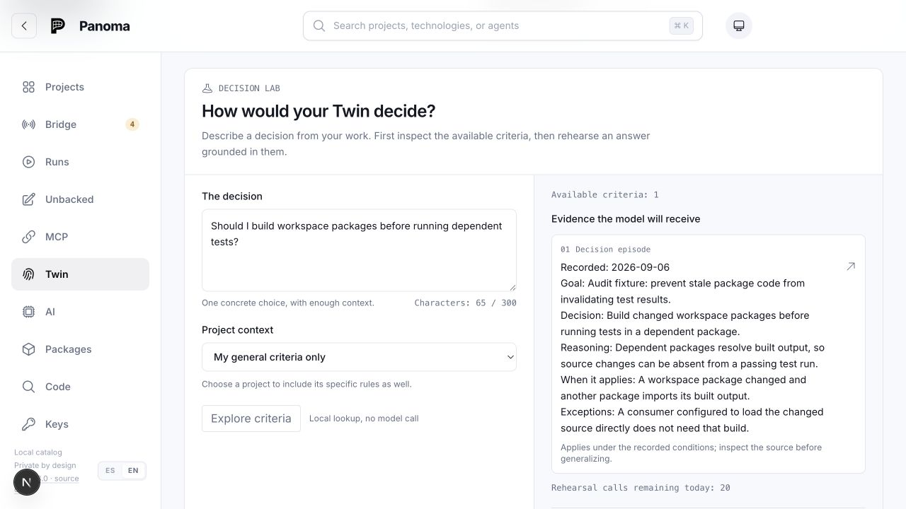

# Memory implementation status, audit and remaining proposal

Audit date: 2026-09-06. Source baseline: `dbea289`.
Status: the reproduced defects were corrected in the same change that added this record. A second
change, the same day, took four more items off the remaining list: task-aware delivery, the
resolution and navigation of the decision archive, the unknown-evidence state of the sentinels, and
the portable export. A third took three more: an expiry date that keeps a decision that no longer
applies out of an agent's context, one wider distillation call instead of several, and a capture
form that asks for one dimension at a time. The architectural proposal remains a direction, not a
claim that every proposed capability exists.
[Spanish reading](../translations/memory-audit-2026-09-06.es.md).

## Current status

The reproduced defects are fixed; the complete proposed memory architecture is not
implemented. This document preserves the original diagnosis and the longer-term design,
alongside the implementation status below. Historical findings describe baseline `dbea289`,
not the corrected working tree.

| Phase | Status in the working tree | What remains |
| --- | --- | --- |
| 1. Integrity | Implemented for reproduced defects F1–F7 | No reproduced defect from that list remains open. Broader design suggestions are tracked below. |
| 2. Delivery | Partial: explicit path lookup, selection by the words of a task with its matched words as the reason, an owner-set expiry that withholds what no longer applies, relevant journal excerpts and complete original reads | Ranking for the operation and the observed error beyond shared words, reconstructing what applied at a past date, and relevance across every memory type. |
| 3. Maintenance | Partial: durable extraction over a window wide enough for a long session in one paid call, bounded retries, coverage receipts, anchor refresh with an explicit unverified state, an owner-set expiry, and decision revision integrity | Semantic checks of project behavior, automatic validity, structured procedures and reviewable consolidation. Draining a remote catalog and a coverage cursor are both deliberately deferred. |
| 4. Product experience | Partial: dedicated project Memory tab, scoped rules, budgets, extraction status, a capture form that asks one dimension at a time, and a decision archive that is searchable, pageable, says where each record is delivered and offers a way out of a legacy conflict | A common view of notes, decisions, procedures and evidence with task/source filters. |
| 5. Outcome evaluation | Pending; regression tests and experiment enrollment fixes are implemented | An original held-out case set, a baseline and measured task outcomes. |
| Installed application | Not updated | Package and install the tested changes; the installed app still runs its previous package. |

The proposal also includes a common relationship model and a coherent deletion contract for
derived records. Those are pending. The versioned portable export exists as of the second
change — `panoma memory export <project>` and `GET /api/memory/export` write one project's
notes, decisions, revision links and extraction receipts as a single JSON document — but
nothing reads it back, so portability is half built by design. Existing local storage,
Markdown projections and decision replacement links do not fulfill the whole proposal.
Semantic archive search is conditional on evaluation showing a need.

The passing regression suite establishes the behavior of the implemented fixes. It does
not establish that the proposed architecture exists or that memory improves task outcomes.

The next proposed delivery is recorded under
[Future implementation: requirements, verification and memory](#future-implementation-requirements-verification-and-memory).
It extends the pending work in maintenance, product experience and outcome evaluation.

Panoma already has the foundations of useful project memory. The original audit found gaps
in validity, revision integrity, retrieval and delivery. The fixes below address the
reproduced failures while leaving broader validity and retrieval work open.

The intended outcome should be concrete: a new agent can resume a project, recover the
reason behind a decision, recognize when that decision no longer applies, and avoid a
previously established failure without making the owner explain everything again.

## Implementation follow-up: project memory

The owner clarified that project memory is the primary surface. The follow-up fixes the
reproduced defects F1–F7 and the delivery, recovery and measurement gaps below. Historical
reproductions and their original source references are preserved in this audit.

| Area | Implemented behavior |
| --- | --- |
| Project memory screen | A dedicated Memory tab replaces the card buried under Assignments. General and path rules have separate sections and visible budgets. Owners can create exact-path or directory rules. Reviewing another note preserves an unfinished draft. |
| Approval integrity | Database transactions lock each project's capacity checks. The note and project are checked together; approval and replacement anchors are committed together, including an empty replacement. |
| Freshness | Local context, note rereads, path hooks and the project screen check saved anchors before reading memory. A stale patrol cannot undo a newer owner approval. |
| Client-independent path delivery | `panoma_context` accepts explicit project-relative files and includes the complete applicable approved rules. The client must request the files; hooks cover their documented edit paths. Memory takes priority over background within the briefing cap; an oversized collection is refused explicitly rather than delivered partly. |
| Evidence retrieval | Journal matches include query-centered excerpts, stable IDs and continuation cursors. Original entries can be read completely in bounded segments, scoped to their project. |
| Extraction | Session closure schedules durable work. Recent source records preserve the final resolution; receipts expose included, omitted and clipped records. Retries, budget deferrals and failure counts are inspectable. |
| Decision memory | Entire revision families permit one active version; stale edits fail explicitly. Eligible owner decisions are filtered before the briefing limit. Incomplete conditional rules carry a do-not-apply warning and a link to the complete record. |
| Measurement | Migration 0052 adds explicit experiment enrollment. Ordinary and older deliveries are excluded from the arm comparison and counted separately. |

Migration 0053 adds the session-keyed extraction queue. Existing notes and decision histories
remain stored; old closed sessions are not automatically scheduled for paid processing.
Migration 0054 indexes revision-family traversal. Legacy families with competing active
versions are withheld from agent briefings and the Lab until the owner resolves them.
The queue survives restarts and project moves. Lease tokens prevent an old worker from
publishing proposals or overwriting a newer receipt after its claim has expired.

A file-existence check is evidence about a path, not proof that every sentence about that
file remains correct. Similarly, a complete delivery does not prove the agent followed it.
Semantic validation, measured task outcomes, archive-wide semantic search and automatic
procedural memory remain proposals. Approved memory still requires the owner's authority.

The updated project flow was exercised in a separate temporary catalog with synthetic
notes, a challenged path, a pending proposal and a completed extraction receipt. Verification
covers preserving a draft across approval, creating a scoped rule, inspecting coverage and
opening decision memory with an empty preference portrait. Screenshots are local evidence
under `.panoma/shots/project-memory-review/`; they contain no production memories.

Final validation: package builds, repository lint, recursive type checking and the complete
suite passed. The suite contains 220 test files and 2,821 tests. Browser verification used
the isolated catalog described above; the installed packaged app was not replaced.

## Second follow-up: four items off the remaining list

The same day, after the record above was written, four of the remaining items were built. They
are named here so the list below is read as history and this section as the present.

| Item | What now exists | What it does not claim |
| --- | --- | --- |
| Task-aware delivery (proposal 5) | `panoma_context` takes `task`: one sentence of at most 1,000 characters. Its words — diacritics folded, stop words dropped — are matched against the project's approved sleeping notes, body and trigger, and against the owner's active decisions the recency brief did not carry; the ranking is the rarity of the shared words. At most eight notes and four decisions, 4,000 characters between them, each delivered with the words that matched and followed by the count of what matched and did not fit. | It is lexical: it finds the word that was written, not the idea. A match is a reason to read the rule, and the briefing says so on every delivery. No ranking for the operation, the file being edited or a historical date. |
| The decision archive (proposal 4) | Families with two live versions are listed at the top of the memory screen, with what withholding them costs, and one click keeps a version and dismisses its rivals through the ordinary route. Every row of the archive names the other live version of its family, whatever its own status, and every card says where that record is delivered: the briefing and the Lab, the Lab alone, nowhere, or withheld. The archive answers a search over the recorded fields and pages older records. | The reach line says a record is eligible, not that it fitted: the six-decision, 1,500-character cap can still cut it. The search is literal. Nothing creates a competing family any more, so the list is empty for a catalog that never had one. |
| Evidence that cannot be read (proposal 3, the honest half) | A patrol whose project root is not a directory on the serving machine returns an explicit unverified count and its reason instead of challenging every anchored note, and the briefing prints one line saying the anchors were not re-checked. That was a live defect locally too: an unmounted volume challenged a project's whole memory at once. | An anchor that holds proves the path exists, not that the sentence about it is still true. Paid extraction against a remote catalog was built and then deliberately switched off again in the third change; the reason and the three guards are in [open-questions.md](open-questions.md). The watcher stays off there as well. |
| Portable export (proposal 7, the export half) | `panoma memory export <project>` and `GET /api/memory/export` write one project's notes in every state, its decisions with revision links and an evidence flag, the owner's general decisions and the distiller's receipts as one versioned JSON document, never a lease token. It asks for the operator key, like the rest of the owner's testimony. | Nothing reads it back, and deletion still has no coherent contract for derived records. Half of portability, said out loud rather than implied. |

The suite that covers them is part of the same change: the selection and its caps, the search
and the paging, the patrol's unknown state with and without a remote catalog, and the export's
refusal to hand over a lease token. Package builds, repository lint, recursive type checking and
the complete suite passed again after it: 226 test files, and tests: 2,880.

## Third follow-up: what a memory that no longer applies costs

The owner read the remaining list and answered it item by item. Three of their answers were
built the same day; two were written down instead, which is also an answer.

**A decision can now say through which day it applies, and after it nobody delivers it.** The
owner sets an optional date on any decision. Past it, the record stops reaching the agents'
briefing, the words of a task and the Lab's evidence, and stays in the owner's archive marked
expired with the offer to clear the date. The audit had proposed either withholding an expired
record or delivering it with a warning; the owner chose withholding, and the reason is the one
that decides most of this page: a rule that no longer holds is not a small error, it is context
the agent paid for and must now argue with. Nothing expires by itself. The date is stored as
that calendar day at 23:59:59.999 UTC, and it is a column rather than a field of the testimony,
because the episode's identity is the hash of its fields and a date there would give a record
that nobody rewrote a new identity.

**A long session travels in one call, not six.** The window went from fifty activities to a
hundred, and the envelope from 24,000 characters to 36,000, still one paid call per closed
session. The proposal on the table was a coverage cursor: read the session in chunks, one call
each. Six calls over a session of three hundred records pay the fixed overhead six times, the
whole system prompt and the 4,000-character memory block, and take six of the twelve paid
extractions a day, half the day on one session. What is still not covered is written where the
constants are: a session past the envelope loses its oldest records, and the receipt's omitted
count is how the owner sees it.

**The capture form asks for one dimension at a time.** The seven optional fields used to open
together behind one toggle, which is why the original audit called the form long. Each is now
added on request, and a field that already holds text is always open, so a revision still
arrives complete.

**Two answers were to write it down rather than build it.** Paid extraction against a remote
catalog was built in the second change and switched off again here: nothing technical stops it,
but the serving key would pay for every project and panoma is local today. And the fifth phase,
measuring whether memory improves a task, is a protocol with its own weeks. Both are now
entries in [open-questions.md](open-questions.md), with who decides them and, for the first,
the three guards that turn it back on.

What this change does not add: no ranking by the operation an agent is performing, no
reconstruction of what applied at a past date, no automatic check that a rule still matches the
code. The expiry is a date the owner writes, and its honesty is the owner's.

## Original audit: scope and evidence before fixes

This section and the original findings below record the initial audit at `dbea289`.
The smaller test count and source line numbers belong to that baseline. The follow-up
above records the subsequent implementation and final validation.

The audit covered curated notes, decision episodes, history extraction, the portrait,
sentinels, contextual delivery, the journal, MCP formatting and memory measurement. The
first-visit documents and the memory decision records were read, including the intentional
limits in [open-questions.md](open-questions.md).

The installed app on port 4173 runs from the installed package rather than this checkout.
Its screen predates the current decision-memory interface. It was inspected to establish
that difference and was excluded from findings about the current UI.

The current checkout was run on port 4175 with a separate temporary `PANOMA_HOME`, separate
Next output and no model configuration. A synthetic decision was entered through the UI,
saved, inspected, and retrieved in the Lab. No real histories were imported and no model
calls were made. Backend probes used migrated in-memory or temporary databases. They
demonstrate specific failure cases, not their frequency in the user's catalog.

Baseline validation passed: package builds, `pnpm lint`, `pnpm -r typecheck`, and `pnpm test`.
The existing suite passed tests: 2,716; files: 212. The audit probes deliberately expose
invariants the existing suite does not cover. Their successful execution does not mean
those invariants passed.

The four accepted screenshots travel beside this report, in `memory-audit-2026-09-06/`. They
did not, until 7-Sep-2026: they were linked from `.panoma/shots/`, which is the product's own
mailbox —where an agent leaves what it has just done— and is ignored by Git on purpose. The
links worked on the machine the audit ran on and were four broken images to everybody else,
which is a poor way to publish a document whose subject is evidence somebody can open.

What stays in that mailbox is the rest of the material, and it stays there deliberately: the two
probes, their recorded output, the capture notes, and the captures that were rejected or kept as
supplementary. Those are named below and not linked, because they are not distributed.

The executable probes are `backend-probe.mjs` and `delivery-probe.mjs`; their corresponding
`*-results.txt` files preserve the observed output. Their headers give the run commands.
They use disposable fixtures and report the expected invariant beside the observed behavior.

## What should survive

- The separation between an event in the journal, an approved durable note, a conditional
  decision, and a belief about the owner's preferences.
- Explicit human authority. Extracting a literal quote proves its provenance; it does not
  prove that a model correctly understood it as a decision or a universal preference.
- Small, bounded initial context, local lookup, visible model costs and source consent.
- Reasons, conditions, exceptions and unknown fields in decision episodes.
- The ability of disk evidence to challenge a note and the owner's ability to resolve it.
- Keeping the Lab's generated answers out of the evidence used to derive or update the portrait.

The absence of automatic compaction is an intentional product decision. So are the note
editing restriction, the lexical archive, the disabled-by-default ablation experiment,
and the current hook coverage. This proposal explicitly reopens some of those choices;
it does not classify them all as bugs.

## Original defects F1–F7: reproduced cases now fixed

All seven reproduced cases below have been corrected and covered by regression tests.
The descriptions preserve how they failed before the fixes. Their suggested directions
are not a claim that every broader capability, such as task ranking, is implemented.

### F1. Decision revisions can have multiple active versions — P1, reproduced

Create A, replace it with B, then replace B with C. Restoring A leaves A and C active.
Alternatively, revising the dismissed A into D leaves C and D active. The briefing and
Lab may consequently receive incompatible versions as independent decisions.

`activeSuccessor` checks only a direct active child in `packages/db/src/episodes.ts:300`.
Restoration and revision in `apps/web/app/api/twin/episodes/route.ts:72` and `:91` do not
enforce a single active version across the entire family. The UI repeats the direct-child
assumption in `apps/web/components/twin-memory.tsx:186`.

Use a stable decision family identifier and one current revision, protected in storage.
Require the expected revision when changing it. A transaction alone does not establish
this invariant; all restoration and revision paths must enforce it.

### F2. Concurrent note writes exceed all three caps — P1, reproduced

| Initial state | Concurrent operation | Observed result |
| --- | --- | --- |
| Awake characters: 1,960 | Add two notes, characters each: 30 | Both accepted; characters: 2,020 / 2,000 |
| Pending proposals: 19 | Propose two notes | Both accepted; proposals: 21 / 20 |
| Approved sleeping notes: 29 | Approve two more | Both accepted; sleeping notes: 31 / 30 |

The usage read and write are separate in `packages/db/src/notes.ts:115`, `:147` and `:212`.
The routes call these helpers without serializing the entire operation; see
`apps/web/app/api/notes/route.ts:53`. Sequential cap tests do not expose the race.

Make budget validation and mutation one serialized operation on every entry path, including
distillation. For a database with multiple writers, enforce the equivalent per-project
locking or isolation in the database rather than relying only on a process-local queue.

### F3. Reapproval can retain the very anchor that was invalidated — P1, reproduced

After deleting the last referenced file, the patrol challenges a note. The owner reapproves
it, but a second patrol immediately challenges it again. `anchorNote` writes the new anchor
set only if it is nonempty: `apps/web/lib/sentinels.ts:217`. An empty new set therefore leaves
the old, failing anchor in place.

Replace the anchor set even when empty, within the approval operation. Make the consequence
visible: an approved note with no remaining verifiable basis is not a verified note.

### F4. Note ID and project scope are not checked together — P2, reproduced at helper level

The note route resolves a `slug`, changes an independent note `id`, and uses that slug's root
for anchoring: `apps/web/app/api/notes/route.ts:62` and `:74`. A mismatched request can approve
a note in project A while evaluating its anchors in project B. The probe with this repository
and its database package loses the anchor that exists under A.

This is an integrity issue; the audit does not claim an external authentication bypass.
Resolve the note by both its ID and owning project, then use that project's root.

### F5. New goals crowd valid decisions out of the briefing — P2, reproduced

A valid owner decision is delivered. Add newer goal-only episodes: 50. The number of
delivered decisions becomes zero, although the original decision remains active.

`apps/web/lib/decision-brief.ts:45` limits the candidate query before the eligibility checks
at `:61`. Filter eligible owner decisions in the database before applying limits. Then
rank for the current task and report omissions. Preserve a way to open the complete record:
fields are currently shortened to 240 characters, which may cut an applicability condition.

### F6. Exact triggers reject real application paths — P2, reproduced

The validator rejects both `apps/web/app/(app)/twin/page.tsx` and
`apps/web/app/api/agent/tasks/[id]/route.ts`. Its segment alphabet excludes parentheses,
brackets and spaces: `packages/db/src/notes.ts:62`.

Validate containment, absolute paths and traversal separately from legitimate file names.
An exact path is a literal string; brackets do not need to become glob syntax.

### F7. Search finds evidence that the response then removes — P2, reproduced

A query matches text beyond character 650 in an entry's details. The returned result body
does not contain that evidence, because `packages/mcp/src/format.ts:791` retains only the
first 600 characters. It marks truncation, but the journal API also omits record IDs and
offers no full-entry read or cursor: `apps/web/app/api/agent/journal/route.ts:44`.

Return an evidence-centered excerpt, stable record ID and continuation. Provide a bounded
read of the original. Keep chronological ordering for historical queries; offer relevance
ordering for troubleshooting rather than imposing one ordering on every intent.

## Original operational gaps and their current status

The following paragraphs preserve the pre-fix diagnosis. Current status:

- Freshness: anchors are checked on memory reads, and a root the serving machine cannot see is
  now reported as unverified instead of read as a fallen anchor; semantic validity remains
  pending.
- Sleeping memory: explicit path lookup and selection by the words of a task are available to
  every MCP client; ranking for the operation itself remains pending and automatic hook
  coverage is still bounded.
- Extraction: recent activities and final resolutions are prioritized, with visible source
  coverage, and the window is now wide enough to carry a long session whole in one paid call;
  a session past that envelope still loses its oldest records, and the receipt says how many.
- Recovery: durable jobs, leases and bounded retries are implemented.
- Measurement: experiment enrollment is separated; measured task benefit is still pending.
- Delivery receipts: every task match reaches the agent with the words that selected it and a
  count of what matched and did not fit, and every decision card says where that record is
  delivered. The servings ledger still records only the awake notes of a delivery, so the
  local receipt of *why* a memory was served is in the briefing, not in the database.

**Freshness is weaker than the sentinel promise.** The patrol runs after catalog reanalysis
(`apps/web/lib/watch.ts:266`), but the root and git watchers are nonrecursive and constrained
by allowlists (`:343`, `apps/web/lib/watch-rules.ts:14`). A nested file can change without a
relevant watched event. Context and path delivery do not verify its anchors before serving.
Automatic anchors generally prove path existence, not the behavioral claim about that path.
This is source-traced; timing across all operating systems was not benchmarked.

**Sleeping memory is not available equally to every agent.** The briefing excludes it and
the normal MCP surface does not expose a general read of applicable sleeping note bodies.
Delivery depends on one client's edit hook and selected tool names
(`packages/core/src/hooks-install.ts:82`). Shell edits are outside that mechanism. Keep the
hook, but provide a client-independent task/path lookup. Documented coverage limits are a
product decision; the missing fallback is a practical obstacle to shared project memory.

**The distiller can miss how a session ended.** The reader takes the first activities, up to
50 (`packages/db/src/agents.ts:847`); the distiller takes detail prefixes of 400 characters
and bounds the combined material at 8,000 (`apps/web/lib/memory-distill.ts:102`). A final
correction can be absent while earlier failed attempts are present. Preserve coverage and
resolution order through bounded chunks. This is a source-traced failure opportunity, not
a measured error rate for model extraction.

**Background extraction is not durable work.** The session-close route starts a promise and
discards failures (`apps/web/app/api/agent/log/route.ts:63`). A crash or exhausted budget has
no durable pending job that makes recovery inspectable. Add a local job record with an
idempotency key, coverage cursor, attempts and bounded retry. A background queue can preserve
the deliberate rule that memory never delays the agent's turn.

**Current measurement cannot establish causal benefit.** Ordinary deliveries are recorded
while ablation is off, without an experiment identifier or assignment version
(`packages/db/src/schema.ts:750`). Aggregation includes all deliveries in the interval
(`packages/db/src/notes.ts:477`), while the API reports only the current switch. Enabling
ablation therefore mixes earlier ordinary served traffic with experimental traffic.
`launchesAfter` is also a noisy project-wide proxy rather than a task correction. Separate
delivery observation, experiments and task outcomes. Never treat a retrieval count as proof
that a memory was correct or useful.

## Original interface observations before fixes

The empty-portrait message and missing decision count described below have been corrected.
Project notes now have their own Memory tab, the archive-navigation observation of the third
point was answered by the search and paging described above, and the capture-form observation
of the second by the per-field reveal. These screenshots show the earlier audit.

The screenshots below are viewport captures, not full-page renders. An attempted full-page
capture duplicated content and was rejected as evidence. The installed-version capture and
a capture taken during smooth scrolling were also excluded.

1. **Enter Twin — mixed.** Navigation anchors are clear, but the initial screen emphasizes
   the portrait and importing histories. Its three headline counters omit decision episodes.
   After saving an episode, the headline still says nothing has been learned because
   `empty` depends only on beliefs (`apps/web/app/(app)/twin/page.tsx:200`). Distinguish an
   empty portrait from an empty memory.

   

2. **Record a decision — healthy, with friction.** A goal or decision is enough to start;
   other fields are optional. Local saving and paid analysis are distinguished. Expanding
   all seven additional fields creates a long form. Offer individual additions such as
   reason, condition and result; retain the existing structured storage. Built in the third
   follow-up: each optional field is added on request, and one that already holds text stays
   open.

   

3. **Inspect what was saved — healthy semantics, limited discoverability.** Conditions and
   exceptions survive; unknown dimensions are explicitly listed. The view only shows recent
   records, up to 100, plus a directly opened record. There is no search/pagination control
   here for finding an older decision by meaning, file or outcome. The source receipt is
   also missing a clear explanation of which agent channels will receive the episode. Both
   were built in the second follow-up: the archive searches its recorded fields and pages
   older records, and every card says where it is delivered.

   

4. **Retrieve in the Lab — healthy for the tested local lookup.** A related English query
   retrieves the synthetic episode and shows its reasons and exception before any model
   call. This is a good pattern to reuse for agent delivery. The audit did not execute the
   paid rehearsal or establish semantic or bilingual recall quality.

   

Small faint metadata has a visible readability risk; the palette's known contrast limits
are already recorded in [accessibility.md](accessibility.md). Labels and expandable controls
were observed in the accessibility tree. This was not a complete keyboard, screen-reader,
mobile or WCAG assessment. Colors were not changed.

## Target memory model: not fully implemented

This section specifies future behavior. Refer to the current-status table for the portions
already implemented; the following contract is not yet an end-to-end product guarantee.

The central contract: every served memory can explain **its source, authority, scope,
validity, revision and reason for delivery**. Keep the existing stores and introduce a common
read model rather than merging everything into one table or one ever-growing text file.

| Layer | Contents | Activation and authority |
| --- | --- | --- |
| Stable project constraints | Few approved invariants | Entire bounded core at task start |
| Current task state | Goal, checkpoint, open questions, next action | Task-scoped; expires or closes with the task |
| Decision episodes | Situation, choice, alternatives, reasons, result, exceptions | Relevant task and historical lookup; owner authority stays explicit |
| Procedures | Preconditions, ordered actions, verification, failure modes | Relevant operation/path; reviewed before durable promotion |
| Evidence archive | Original journal entries and permitted source excerpts | On demand with stable IDs, excerpts and complete reads |

The following behavior is a proposal to implement from scratch, not a claim of research novelty.

**1. Distinguish truth from authority.** An owner can authorize a preference. A repository
fact still needs evidence. Store authority, provenance and validity as separate dimensions;
do not hide them inside a single confidence percentage. A quoted assistant suggestion must
not become an owner decision just because it is frequent.

**2. Separate time recorded, time applicable and time checked.** Retain `recordedAt`, optional
`validFrom`/`validUntil`, and `lastVerifiedAt` with the observed evidence fingerprint. A
rarely retrieved rule can remain true. A recent quote can refer to an old environment.
Historical questions should reconstruct what applied then rather than return today's rule.

**3. Make conditions executable only where justified.** Support small typed predicates such
as a manifest script's value, a package dependency edge, an exported symbol or a path.
Evaluate only the relevant predicates with bounded work and no arbitrary shell commands.
Use `valid`, `invalid` and `unknown`. A changed whole-file hash should schedule checking,
not automatically declare a behavioral rule false. Human preferences may have no mechanical
predicate; say so.

**4. Give revisions and relationships an identity.** Preserve explicit `supersedes`,
`supported_by`, `contradicts`, `exception_to` and `result_of` links. Suggested similarity
is a different relation from confirmed support. A visible graph is optional; useful
navigation to the source and replacement is the first deliverable. Repeated copies of the
same source are one piece of evidence, not independent corroboration.

**5. Retrieve for an action, not just a sentence.** Accept task intent, operation, paths,
observed error and optional historical time. First filter by scope, authority, revision and
validity; then rank lexical matches and explicit relationships; finally fit the budget.
General preferences and project-specific exceptions must be considered together. Never
truncate away the exception and leave its rule appearing unconditional. A source-read link
and explicit incomplete status are preferable to such a claim.

The always-on core remains complete and small. The rest is progressively opened through a
shared HTTP/MCP read path. Existing hooks call the same selector. Retrieval should not
require a paid model; local embeddings are a later option only if a project-specific test
set demonstrates that lexical search and explicit relationships are insufficient.

**6. Make consolidation reviewable and atomic.** Offer an explicit before/after replacement
of several approved notes, preserving their sources and revision history. The owner approves
the concrete result, and the final set is validated against the budget in one transaction.
This would reopen the current discard-and-rewrite UI decision while preserving its human
authority. No summary of a summary silently replaces primary evidence.

**7. Keep memory portable and deletion coherent.** Provide a versioned local export of records,
relationships and source metadata; keep search indexes rebuildable. Markdown views can be
readable projections of the database. Define forgetting separately from source revocation:
revocation stops future ingestion; deletion must remove or invalidate affected derivatives,
indexes and cached projections. Preserve independently owner-authored records where the
owner explicitly chose to keep them. Do not imply today's implementation already guarantees
all of this.

**8. Record receipts, not imaginary impact.** A local delivery receipt should identify the
task/session, record revisions, selection reason, omitted material and evidence status.
Available, delivered, opened, applied and useful are distinct events. Only observed outcomes
support a claim that the action improved; self-reported success is not independent evidence.

## Proposed example: not an implemented flow

An agent is about to test a dependent package after changing a shared library. Panoma
recognizes the dependency edge and retrieves the decision that stale built output caused a
misleading pass. The receipt shows the reason, the current import configuration that was
checked, and the exception for consumers that load source directly.

When the consumer changes to load source, the original event remains in history but the
procedure's prerequisite no longer holds. Panoma omits the build advice for that task and
can explain why. When the relevant configuration is unreadable, it reports the uncertainty
instead of claiming that the procedure is current.

This makes memory behave like maintained project knowledge: it can preserve why a rule
existed while recognizing when to stop applying it.

## Research implications

Public implementation and documentation patterns informed the distinction between a small
core, a navigable archive and procedures loaded on demand. No external implementation was
copied. Public documentation was not treated as proof that an unavailable application core
had been inspected. Product names and their repository references are intentionally omitted.

Recent work evaluates memory across static facts, changing state, workflows, recurring
pitfalls and wrong premises. That is a useful evaluation shape for Panoma, although its web
agent setting is not evidence of a particular gain here.
[Evaluation of environment experience, May 2026](https://arxiv.org/abs/2605.12493).

Another preprint distinguishes temporal, factual and conditional conflicts, and separates
missing evidence from poor use of retrieved evidence. Its controlled histories support a
test taxonomy, not a performance promise for this product.
[Evaluation of conflicting memories, May 2026](https://arxiv.org/abs/2605.20926).

Procedural-memory experiments report that some skills transfer and others specialize to
their original context. Panoma should test procedures outside the episode that produced
them and preserve prerequisites and exceptions.
[Procedural memory and transfer, June 2026](https://arxiv.org/abs/2606.23127).

## Future implementation: requirements, verification and memory

**Status: planned.** This section records future work; it does not mark these capabilities
as implemented or enable autonomous decisions. The first deliverable is one complete task
whose acceptance criteria, checked change, observed results and supporting memory can be
inspected together.

The chain to preserve is: requirement → code version → executed check → observed result
and artifacts → linked rule or decision. Reuse existing task, run and build-check records
where their contracts fit, rather than creating a parallel history.
The existing run verification flag describes that execution's tests, not fulfillment of
every task requirement.

| Order | Deliverable | Acceptance criteria |
| --- | --- | --- |
| 1 | Separate reported completion from verified criteria | A task may retain the agent's completion report without claiming verification. Each criterion shows passed, failed or unverified, its evidence and any omitted coverage. Checks are tied to the application version and the test version; uncommitted changes are identified. Evidence from another revision does not silently validate the current change. |
| 2 | Connect rules and decisions to observed evidence | A memory opens the check that supports it, the applicable project/version and its conditions. Owner approval and technical validity remain separate. A relevant change triggers reassessment; unreadable evidence remains unknown. Previous evidence stays historical rather than becoming a current guarantee. |
| 3 | Make selected architectural decisions executable | A small set of important, mechanically testable decisions has explicit checks, such as package boundaries or authorization rules. The check passes a valid fixture and detects a deliberately broken one. Decisions requiring judgment remain identifiable as such. |
| 4 | Evaluate before extending delegated authority | An isolated case set measures task outcomes, memory validity, exception preservation, abstention and owner intervention separately. Only then consider bounded answers grounded in explicit owner decisions, with scope, sources and abstention. Any change to agent authority remains a separate product decision. |

**Evidence contract.** Each check records its runner, command or check identifier, environment,
time, result and local artifacts, including limitations and truncated output. Record the
source of each field: an agent assertion, an imported report or a result captured by the
executor. A screenshot, trace, successful command or referenced commit supports only the
behavior it actually checks. Imported results keep their origin and are not silently
presented as independently verified local executions. A browser flow needs assertions about
the relevant final state, not only a record of which screens were visited.

**Memory contract.** Link acceptance criteria and evidence to existing memory records through
stable identifiers. Keep the scope and revision of each link inspectable. A successful check
does not automatically promote an agent's interpretation to an owner-approved rule, and
retrieving an old decision does not grant permission for a new action.

**Evaluation contract.** Build on the original case set below, with expected outcomes kept
separate from material used to tune the system. Compare against a fixed baseline under the
same reader settings and repeat trials where model variation matters. Include irrelevant
memory, stale evidence, local exceptions, unsupported conclusions and correct abstention.
Measure task success, repeated errors, owner interventions, latency and known resource use;
unavailable cost data stays unavailable. Agreement with the owner and technical correctness
are separate measures. Provider failures and unusable responses are counted separately from
deliberate abstention. A global agreement percentage alone cannot authorize broader
delegation. Keep the evaluation isolated from ordinary work and its required safeguards.

**First delivery acceptance.** An owner can open a completed task and see what was requested,
which change was checked, what actually passed, what remains unverified and which memory is
supported by that evidence. Changing the relevant code leaves the old result available but
prevents it from being presented as fresh verification. This flow is the first slice to
implement before expanding the evidence model across every task and memory surface.

## Implementation sequence and acceptance criteria

| Phase | Status | Remaining acceptance work |
| --- | --- | --- |
| 1. Integrity | Implemented for F1–F7 | Regressions cover the reproduced cap races, revision families, reapproval, project scope, eligibility, exact paths and evidence retrieval. |
| 2. Delivery | Partial | Ranking for the operation and the observed error beyond shared words, and reconstructing what applied at a past date. Explicit path selection, selection by the words of a task, the expiry that withholds what no longer applies, and complete source reads already exist. |
| 3. Maintenance | Partial | Typed semantic checks and validity a machine can decide; procedures and reviewable atomic consolidation. Durable jobs, a window wide enough for a long session, bounded coverage receipts, an unverified evidence state and an owner-set expiry already exist. |
| 4. Product experience | Partial | Unified project/task/source navigation and relationship explanations. The project Memory tab, the searchable decision archive with its conflict resolution, the per-record delivery reach and the portable export already exist. |
| 5. Evaluation | Pending | Separate retrieval and task-performance measurements with a held-out set and unchanged reader settings. Regression tests and enrollment instrumentation do not replace this evaluation. |

Start the corpus with cases: 24–40. Include a changed command without a deleted file, three
successive revisions, a project exception to a general preference, historical queries,
different requirements on two branches, bilingual paraphrases, a late session correction,
an irrelevant recent-record flood, a missing source, and deletion with derivatives. Repeat
after new evidence is ingested to expose regressions over time.

Measure evidence recall, validity/authority violations, exception preservation, correct
abstention, task success, correction recurrence, latency and context size. Protect critical
constraints in every case. Establish a local baseline before setting improvement targets;
no numerical gain is justified by this audit alone.
