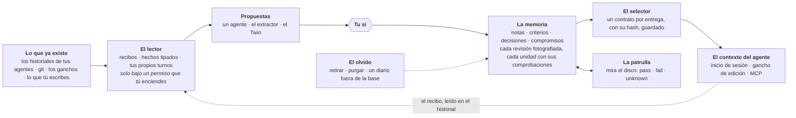

<div align="center">

[Read in English](../README.md)

<picture>
  <source media="(prefers-color-scheme: dark)" srcset="../docs/readme/logo-dark.png">
  
</picture>

# panoma

[](https://github.com/PanomaAI/panoma/actions/workflows/tests.yml)
[](../LICENSE)
[](https://www.npmjs.com/package/panoma)

**El catálogo local de tus proyectos.** Todo lo que construiste —incluido lo que nunca
subiste— listo para retomar, por ti o por tus agentes.


<em>Un comando, sin instalar nada y sin subir nada — y cada proyecto del disco vuelve con
una cara, un nombre y un pulso.</em>

</div>

---

## El mismo disco, dos veces

<div align="center">
  
  <br>
  <em>Lo que te da el disco. Cada una de esas carpetas fue una decisión en su momento.</em>
  <br><br>
  
  <br>
  <em>Lo que hace panoma con él. Las mismas carpetas, el mismo disco, sin subir nada.</em>
</div>

---

`panoma` es un **catálogo local de proyectos** (piénsalo como el App Store de tus propios
proyectos). Le das una carpeta y te devuelve la ficha de cada cosa que vive en tu disco:
pila, dependencias, salud, dónde se distribuye, qué quedó sin subir y qué agente de IA
tocó qué. Las plataformas construyeron torres de control que solo ven sus propios
aviones; panoma ve el cielo entero: tu disco.

La arquitectura, las decisiones de diseño y los límites conocidos de cada pieza se
cuentan más abajo y en [`docs/`](../docs/README.md), que tiene índice. Lo que no está aquí es el plan de negocio:
este repositorio lleva el producto, no la hoja de cálculo.

## Estado

**Local y funcionando de punta a punta** — motor, catálogo, web, CLI, servidor MCP y
despacho de propuestas.

- [x] Motor de detección: npm, pub/Flutter, PyPI, Go, Cargo, RubyGems, Composer
- [x] 83 reglas de identificación de tecnologías con rastro de evidencia
- [x] Estadísticas de lenguajes, detección de icono, objetivos de distribución
- [x] Puntuación de salud
- [x] Atribución de agentes de IA vía trailers de git
- [x] Detección de familias de copias del mismo proyecto
- [x] CLI `panoma scan`
- [x] Esquema PostgreSQL (Drizzle) + API de ingesta
- [x] Interfaz web tipo App Store
- [x] Últimas versiones desde 7 registros públicos
- [x] Vulnerabilidades vía OSV.dev
- [x] Servidor MCP: contexto, bitácora y cola de tareas para agentes
- [x] Despachar propuestas de actualización verificadas en aislamiento
- [x] Trabajo sin respaldar: sin commitear, sin subir, sin remoto, sin repositorio
- [x] Espacio en disco y qué parte de él se regenera con un comando
- [x] Búsqueda de código en todos los proyectos a la vez
- [x] Credenciales commiteadas (se lee lo que git sigue; buscar en la historia completa, pendiente)
- [x] Recursos y assets que ningún fichero de código menciona
- [x] Cómo se arranca cada proyecto, qué runtime necesita y qué variables le faltan
- [x] Paleta de comandos (⌘K)
- [x] Descripción real de cada proyecto, descartando el texto de plantilla
- [x] De dónde salió: propio, bifurcado, clonado o generado por una plantilla
- [x] Descripción escrita por el modelo que conectes, etiquetada como tal
- [x] El catálogo se mantiene solo: un vigía ve nacer proyectos y re-analiza los que cambian
- [x] El parte del día: qué pasó desde la última vez, con qué agente firmó cada commit
- [x] Interfaz en español e inglés: selector ES·EN, cookie y `Accept-Language` (docs/i18n.md)
- [x] Acceso desde el móvil con credencial: `panoma up --network` (docs/network-access.md)
- [x] El canal de agentes, endurecido: toda puerta con su guarda, la clave en 0600 y el texto ajeno que no puede salirse de su bloque (docs/mcp-security.md)
- [x] El .md de los agentes: linter contra el disco real, bloque que se cuida solo, quién tocó el fichero, los heredados de arriba y la opinión del modelo (docs/agents-md.md)
- [x] Memoria curada por proyecto: los agentes proponen hechos durables, tú apruebas, y lo aprobado llega al primer turno de todos — con presupuesto que se niega a compactar (docs/memory.md)
- [x] Un contrato de memoria: un selector sobre el archivo entero, una oferta por entrega con sus hashes y su manifiesto de unidades, y un recibo leído en el historial del propio agente que dice, unidad por unidad, qué llegó al contexto (docs/memory-contract.md)
- [x] Captura y extracción bajo tres interruptores separados: hechos tipados de lo que hicieron las herramientas, nunca una línea de texto; tus propios turnos enviados al modelo en una ventana congelada antes de pagarla; cada llamada de pago reservada en el libro antes de salir (docs/memory-capture.md)
- [x] Comprobaciones con propósito sobre cada unidad de la memoria, una patrulla que mira el disco en las pasadas libres del trabajador y contesta pass, fail o unknown, incidencias con tu veredicto encima, compromisos que solo cierras tú o tus criterios, y condiciones tipadas juzgadas en tres valores (docs/memory-checks.md)
- [x] Un Twin que aprende solo bajo un tercer interruptor, cuenta su apoyo en casos y no en mensajes, y escribe tu fichero de gusto por un buzón de salida que compara antes de escribir y relee después (docs/twin-learning.md)
- [x] Un olvido que sobrevive a una copia de seguridad —retirar o purgar, con plan previo, anotado en un diario fuera de la base, con cuarentena cuando los dos discrepan— y una cuota de almacenamiento que pausa a la máquina y nunca a la persona
- [x] Apps oficiales opcionales, con su propia pantalla: manifiesto validado, versiones que se activan y se revierten, y cada trabajo en un proceso aparte (docs/apps.md)
- [x] panoma video, la primera app: añade una pantalla de producción a cada proyecto y un botón «Crear vídeo» en la cabecera, se instala desde npm como [`@panoma/video`](https://www.npmjs.com/package/@panoma/video), y un agente con clave puede pedir una producción del proyecto en el que está con las herramientas MCP `panoma_video` — con el modelo y la voz que tú activaste, nunca los que él elija
- [x] Pantalla de gasto: cada llamada al modelo queda anotada, con un tope diario para cada una de las nueve familias, que puedes subir, bajar, poner a cero para apagar esa familia o dejar como viene de fábrica (docs/budgets.md)
- [x] El puente: los cuatro pasos de la puesta en marcha —catálogo, modelo, agente y registro automático—, uno cada vez, separados de lo que los agentes ya han anotado
- [x] Ejecución en contenedor efímero: el nivel `container`, con docker, podman, nerdctl o finch, que baja a `hardened` y dice por qué cuando no hay ninguno (docs/run-and-isolation.md)
- [x] Relevo: seguir una conversación en otro agente, o en el mismo tras iniciar sesión, con `panoma handoff`, la pantalla `/handoff` o —cuando tú se lo pides— el propio agente, con las herramientas MCP `panoma_conversations` y `panoma_handoff`; panoma escribe una conversación nueva en el historial propio del agente de destino para que su reanudación normal la encuentre, el original no se toca, y el recibo dice qué viajó, qué se quedó y quién lo pidió (docs/handoff.md)
- [ ] Ejecución en CI
- [ ] Notificaciones
- [ ] Maven/Gradle y NuGet (vía Syft)

Y la raya que no se mueve: todo lo que este README describe —el motor, el CLI, el
catálogo, el canal de agentes, la memoria— es software libre y lo seguirá siendo. Si
algún día existe una nube alojada, será un servicio comercial aparte construido encima
de este código, no un muro delante de él; que lo libre siga libre es cláusula de
contrato (§4 del [CLA](../CLA.md)), no una entrada de blog.

## Probarlo

Sin instalar nada y sin cuenta. Analiza la carpeta e imprime qué proyecto vive dónde,
cómo arranca cada uno, cuántos commits existen solo en este disco y qué agentes tocaron
cada cosa. Tu código no sale de tu máquina.

```bash
npx panoma scan ~/Desktop
```

## Montarlo desde el código

Hacen falta **Node 22 o superior** y **pnpm**. El suelo es la 22 porque es lo que el CI
mide de verdad: en cada push corre sobre Linux con las versiones 22 y 26; Windows entra una
vez por semana y cuando se pide a mano, y macOS solo si se pide.

```bash
pnpm install
pnpm --filter "./packages/*" build
```

Levantar el catálogo web:

```bash
pnpm --filter @panoma/web run dev
```

Y llenarlo (la web tiene que estar corriendo):

```bash
pnpm exec tsx apps/cli/src/index.ts scan ~/Desktop --save
```

Traer últimas versiones y avisos de seguridad:

```bash
pnpm exec tsx apps/cli/src/index.ts enrich
```

Abre http://localhost:4173.

Escanear es cosa de una vez: a partir de ahí el **vigía** mantiene el catálogo al día.
Vigila cada proyecto (manifiestos, lockfiles, `.env`, la cabeza de git) y las carpetas
donde viven, así que un `git clone` o un `flutter create` junto a tus proyectos entra
solo al catálogo, y un commit re-analiza su ficha. Sin recursividad y sin tocar la red;
estado en `/api/watch`, se apaga con `PANOMA_WATCH=0`.

Se despierta solo: cualquiera que abra panoma lo arma si estaba dormido, al arrancar pone
al día lo que cambió mientras no miraba, cada cinco minutos se comprueba a sí mismo y
cada doce horas trae versiones y avisos nuevos sin que nadie teclee `enrich`.

### El parte del día

Lo primero que se ve al abrir panoma: **qué ha pasado desde la última vez que miraste**.
Commits nuevos —con el agente que los firmó, leído del trailer `Co-Authored-By`—, las
propuestas terminadas que esperan tu decisión, y los proyectos que entraron solos. Nada
de salud, pila ni dependencias: eso se mueve en semanas y ya tiene sus páginas.

La ventana es pegajosa: refrescar no vacía el parte (durante media hora enseña lo mismo)
y volver de vacaciones no vuelca dos semanas de golpe (tope de catorce días).

### Las cuatro preguntas que solo puede contestar un catálogo

Ninguna herramienta que mire un proyecto a la vez puede responder a estas, porque todas
son sobre el conjunto:

```bash
pnpm exec tsx apps/cli/src/index.ts disk               # cuánto disco ocupa y cuánto vuelve solo
pnpm exec tsx apps/cli/src/index.ts search "stripe"    # dónde escribí yo aquello
pnpm exec tsx apps/cli/src/index.ts secrets            # qué claves commiteadas hay en tus repos
pnpm exec tsx apps/cli/src/index.ts describe kestrel   # que el modelo explique de qué trata
```

Las cuatro necesitan la web levantada: el trabajo lo hace el servidor, que es quien
puede escribir en la base de datos. `describe` pide además un modelo conectado
(`panoma ai`). Y `secrets` sale con código distinto de cero cuando encuentra algo,
para que sirva en un gancho de git o en CI.

Sobre el portafolio de referencia (81 proyectos): 48,7 GB regenerables de 56,7 totales,
55 credenciales commiteadas en 14 proyectos, y 56 proyectos con algo sin respaldar —
de los cuales 23 no están bajo control de versiones en absoluto.

### Proponer una actualización

```bash
pnpm exec tsx apps/cli/src/index.ts run <proyecto> <paquete>
```

Aísla el proyecto en un `git worktree`, edita el manifiesto, instala, ejecuta los tests y
deja una rama con el parche. **No aplica el cambio en tu carpeta, no hace push y no abre
ningún PR.** Si el proyecto no tiene tests, la propuesta se marca *sin verificar* en vez
de darse por buena.

### Conectar un agente

```bash
pnpm exec tsx apps/cli/src/index.ts agent-key "Claude Code"
```

Imprime la clave y el bloque MCP listo para pegar; con `--install` lo escribe él, en el
fichero que ese agente lee de verdad —`.mcp.json` del proyecto para Claude Code,
`.cursor/mcp.json` para Cursor, `~/.gemini/settings.json` para Gemini CLI. Para Codex
fusiona la tabla `[mcp_servers.panoma]` dentro de `~/.codex/config.toml`, en su sitio y sin
tocar el resto; y cuando no puede prometer que deja ese fichero como estaba, lo dice y no
escribe nada. Desde la aplicación es un botón: **Agentes → Conectar**.

Ese fichero lleva la clave en claro, así que se escribe en 0600 y panoma avisa si git se
lo llevaría. Qué protege cada puerta del canal —y qué no protege ninguna— está en
[docs/mcp-security.md](../docs/mcp-security.md).

Hay que reiniciar el agente después. A partir de ahí dispone de quince herramientas:

| Herramienta | Para qué |
|---|---|
| `panoma_context` | el parte: pila, dependencias atrasadas, vulnerabilidades, tareas y qué hicieron otros agentes. Con `files`, las reglas fijadas a esas rutas; con `task`, las reglas y decisiones cuyas palabras se solapan con lo que vas a hacer. Con `memoryVersion: 2`, el contrato de memoria: cada unidad entera, qué queda por comprobar, qué no cupo y por qué, y una continuación para el resto |
| `panoma_log` | registrar un cambio, una decisión o un bloqueo |
| `panoma_remember` | **proponer** un hecho durable para la memoria del proyecto. No se sirve a nadie hasta que lo apruebas tú |
| `panoma_recall` | buscar en la bitácora entera, página a página, y abrir cualquier entrada completa. Con `memoryKind` y `memoryId`, leer entera una unidad de la memoria —una nota, un criterio, una decisión, un compromiso o el caso de una tarea— en la revisión pedida |
| `panoma_ask` | dejarle una pregunta de criterio a tu doble en vez de interrumpirte |
| `panoma_tasks` | ver la cola del proyecto, abierta y cerrada |
| `panoma_create_task` | anotar deuda técnica sin salirse de lo que está haciendo |
| `panoma_claim_task` | coger una tarea sin pisarse con otro agente |
| `panoma_complete_task` | cerrarla explicando cómo |
| `panoma_conversations` | las conversaciones guardadas para este proyecto, de la más reciente a la más antigua, y los recibos de lo que ya se relevó. Se leen de los almacenes propios de los agentes, en esta máquina; mirar no ingiere nada |
| `panoma_handoff` | seguir esta conversación en otro agente, cuando tú lo pides. La copia va al historial propio de ese agente con el resumen mecánico; `dryRun` enseña qué viajaría y no escribe nada. El mismo agente no es destino por este canal |
| `panoma_apps` | las apps opcionales de esta máquina: versión instalada, si está lista, cada requisito, el modelo y la voz que activaste, y tu siguiente paso cuando alguna no lo está |
| `panoma_video` | hacer un vídeo de este proyecto con panoma video, cuando tú lo pides: un trabajo durable a nombre del agente, con los ajustes que confirmaste en la página de la app. Instalar, activar y encender un proveedor siguen siendo tuyos |
| `panoma_video_jobs` | las producciones del proyecto, o una entera: sus doce etapas, los cortes con sus ficheros en esta máquina, los tipos de vídeo descartados y por qué, lo que gastó; `wait` espera a que se mueva |
| `panoma_video_cancel` | parar una producción de este proyecto |

El contrato de cada una está en [docs/agent-channel.md](../docs/agent-channel.md).

### Relevar una conversación

Llega el límite de uso, o el siguiente paso pide otra herramienta, y la conversación tiene que
seguir en otro sitio. Listar lo que tus agentes guardaron en este disco, lo más reciente
primero:

```bash
pnpm exec tsx apps/cli/src/index.ts handoff
```

Seguir en Codex la conversación más reciente de esta carpeta. Panoma la escribe en el
historial propio de Codex con un id nuevo, para que `codex resume` la encuentre como una suya;
el original no se toca:

```bash
pnpm exec tsx apps/cli/src/index.ts handoff --to codex
```

Mandar el resumen y los últimos turnos en vez de todos, cuando la conversación es grande:

```bash
pnpm exec tsx apps/cli/src/index.ts handoff --to claude --tier compact
```

Ver qué viajaría y qué se quedaría, con las cifras, sin escribir nada:

```bash
pnpm exec tsx apps/cli/src/index.ts handoff --to opencode --dry-run
```

Llevársela a otra máquina como fichero portátil, fuera del almacén de cualquier agente:

```bash
pnpm exec tsx apps/cli/src/index.ts handoff --to bundle --out conversation.json
```

Claude Code, Codex CLI, OpenCode y Gemini CLI reanudan la copia ellos mismos; Claude (app) y
Codex (app) la abren por un enlace en macOS; Cursor, Copilot, Aider, Amp y Goose reciben un
documento para pegar. Los bloques de razonamiento, las imágenes y las ejecuciones de subagentes
no viajan nunca, los secretos se enmascaran, y cada cifra se enseña antes de escribir nada. La
pantalla `/handoff` hace lo mismo detrás de la clave de operador, y un agente con clave puede
hacerlo para el proyecto en el que está con `panoma_conversations` y `panoma_handoff`, solo
con el resumen mecánico y nunca hacia el mismo agente. El mismo agente, con la cuenta con la
que quieres continuar, no escribe nada en `full`: cada almacén es por máquina y por carpeta,
nunca por cuenta, así que panoma imprime tus propios pasos —cerrar sesión, iniciarla, reanudar—
y no ejecuta ninguno; en `compact` escribe una copia más corta en el mismo almacén.
[docs/handoff.md](../docs/handoff.md) tiene la decisión, las versiones contra las que se
verificó cada almacén y qué no cruza nunca la raya.

Analizar un proyecto:

```bash
pnpm exec tsx apps/cli/src/index.ts scan .
```

Encontrar y analizar todo lo que haya bajo una carpeta:

```bash
pnpm exec tsx apps/cli/src/index.ts scan ~/Desktop
```

Ficha completa con dependencias y desglose de salud:

```bash
pnpm exec tsx apps/cli/src/index.ts scan ~/mi-proyecto -v
```

Encontrar copias del mismo proyecto y saber cuál es la versión viva:

```bash
pnpm exec tsx apps/cli/src/index.ts scan ~/Desktop -d
```

Exportar el portafolio entero a JSON:

```bash
pnpm exec tsx apps/cli/src/index.ts scan ~/Desktop --json --out portafolio.json
```

## La memoria

La memoria de panoma no es el registro de un chat. Vive al lado del disco, así que puede
darse cuenta sola de que algo que recuerda ha dejado de ser verdad; nada entra en ella sin tu
sí; y cada byte que le entrega a un agente queda anotado antes de salir del proceso y se lee
después en el propio registro del agente. Esta sección cuenta el ciclo entero. Los registros
de decisión de cada parte son [docs/memory.md](../docs/memory.md),
[docs/memory-contract.md](../docs/memory-contract.md),
[docs/memory-capture.md](../docs/memory-capture.md),
[docs/memory-checks.md](../docs/memory-checks.md) y
[docs/twin-learning.md](../docs/twin-learning.md).



### Qué se recuerda

Cuatro pisos, y cada uno contesta una pregunta distinta:

| Piso | Qué guarda | Quién lo escribe |
|---|---|---|
| **La bitácora** | Todo lo que los agentes anotaron aquí, para siempre y buscable página a página. *Qué pasó.* | Los agentes, con `panoma_log` y los ganchos |
| **La memoria curada** | Reglas cortas y durables: una nota de 500 caracteres como mucho, un criterio de tu gusto, una decisión con su porqué, un compromiso que asumiste. *Qué sigue siendo verdad.* | La propone cualquiera; la aprueba solo tú |
| **Las notas que duermen** | Una nota con un *dónde*: una ruta exacta o una zona como `apps/web`. No cuesta nada en el parte y despierta cuando un agente va a tocar esa ruta. | La misma puerta |
| **Las comprobaciones** | Cómo tiene que estar el disco para que una regla se sostenga: un script que debe existir, un literal que no debe volver, una dependencia que debe estar declarada. | Tú, sobre cualquier unidad de la memoria |

Cada unidad lleva una **revisión**, y cada cambio fotografía la fila tal como estaba, para
que una entrega pueda decir qué revisión viajó y una mirada pueda decir qué revisión miró.
Una nota puede quedar **sustituida** por una reescritura que la nombra, o recibir un día de
**validez**; nada caduca solo y nada se edita en el sitio.

### Nada se sirve sin tu sí

Los agentes solo pueden proponer. Un agente propone un hecho con `panoma_remember`; el
extractor propone a partir de tus propios mensajes; el Twin propone un criterio a partir de lo
que les dijiste a tus agentes. Todo cae en la misma cola, con tope de 20 para que revisar no
se convierta en la tarea que nadie hace, y aprobar o descartar vive detrás de un gesto en
pantalla, nunca detrás de una clave de agente. Una nota aprobada se le enseña a todo agente que
abra el proyecto, así que una memoria envenenada sería un virus con altavoz; la revisión es el
antivirus.

La memoria es **pequeña a propósito**: 2.000 caracteres de memoria despierta por proyecto,
30 notas dormidas, 3.000 caracteres en el retrato de tu gusto. Como cabe entera delante del
modelo, no hay paso de recuperación que pueda elegir el recuerdo equivocado, y cuando se llena
nada se resume a tus espaldas: se te dice, y decides qué sale. Encima de los presupuestos de
caracteres hay una **cuota de almacenamiento** para todo lo que la máquina deriva sola
—fotografías, ofertas, hechos, respuestas preparadas—: 256 MiB por catálogo y 64 MiB por
proyecto de fábrica. Una cuota llena pausa a la máquina, nunca a la persona: lo que apruebas o
escribes a mano entra siempre, y no se borra nada para hacer sitio.

### Lo que recibe un agente es un contrato

Antes de la entrega A había tres lectores con tres universos y ningún recibo: lo que recibía
una sesión dependía del camino por el que entraba. Ahora hay **un selector** sobre todo el
archivo elegible y **un contrato** por entrega, `MemoryContractV2`:

- **`items`**: cada unidad que viajó, entera: su tipo, revisión, ámbito, autoridad, el texto y
  su porqué, sus condiciones y excepciones. Una unidad es indivisible: una regla viaja con sus
  excepciones o no viaja.
- **`checks`**: lo que panoma no pudo resolver, como texto, para que el agente sepa qué queda
  por comprobar antes de actuar.
- **`omissions`** y un **`manifest`**: lo que no cupo, por motivo y recuento, legible entero
  por id. Una unidad obligatoria nunca se descarta para hacer sitio a una opcional; si el
  núcleo solo no cabe, el contrato dice `incomplete` en vez de fingir.
- **Un estado**: `ready`, `requires_check`, `conflict`, `incomplete` o `unavailable`. Dos
  decisiones activas de la misma familia se retienen como `conflict` en vez de resolverse
  eligiendo la más nueva.

El orden del selector es la decisión: primero la elegibilidad, luego el núcleo entero y sin
clasificar (las notas despiertas, los criterios publicados, las notas dormidas que dispara una
ruta tocada), luego una búsqueda léxica sobre todo el archivo —una decisión anotada detrás de
otras 250 más nuevas se encuentra por sus palabras—, y al final los límites, nunca los límites
primero. Cada entrega es una **oferta** anotada antes de que sus bytes salgan del proceso, con
el SHA-256 de su contenido y del texto exacto emitido, y un manifiesto con el rango de bytes de
cada unidad dentro de ese texto.

El contrato llega al agente por tres caminos: el gancho `SessionStart` lo imprime en un
contexto nuevo de Claude Code al arrancar, reanudar, limpiar y compactar; el gancho de edición
entrega las notas dormidas de la ruta que se está tocando; y `panoma_context` lo lleva por MCP.
Cada camino tiene un límite medido —6.500 puntos de código y 24 KiB para el parte, 24 KiB para
MCP— contado sobre el mensaje que recibe el programa, y nunca llamado tokens.

### El recibo

Una oferta prueba lo que panoma preparó; no prueba que llegara nada. Con el interruptor de
captura encendido, un lector abre el historial del propio agente —solo lectura, jamás se
modifica— y busca esos bytes exactos en el único sitio que sella una recepción: el registro
que el agente escribe para la salida del gancho, en la sesión a la que se ató la oferta. Y
anota lo que encontró, unidad por unidad: `full`, `partial`, `unknown` o `not_observed`. Los
mismos bytes en un prompt, en el resultado de una herramienta o en un README nunca son una
recepción; en un programa que nadie ha verificado, la recepción es `unknown` y nunca `full`. Un
contexto se cuenta por sesión y por generación: una compactación o un `/clear` lo vacían y el
siguiente parte es un contrato nuevo, así que una regla nunca se calla porque la vio un
contexto que ya no existe.

El catálogo guarda una **matriz de capacidades** por programa, rellenada con tres evidencias
separadas —se instaló un gancho, se observó una invocación, una persona verificó el sitio del
recibo leyendo el registro— y un programa fuera de ella recibe `unknown` en cada eje.
Verificado hoy: Claude Code 2.1.258 desde la app de escritorio. Lo que no está verificado se
declara, nunca se cuenta.

### Leer los historiales, bajo tres interruptores

Cada historial de agente que hay en el disco es una fuente, y nada de dentro se abre hasta que
permites esa fuente por su nombre en la pantalla del Twin. Encima de ese permiso base hay tres
**concesiones**, cada una con un propósito, un ámbito —un proyecto o todos— y una frontera
dentro de cada fichero:

1. **Captura.** Con el primer aviso el lector toma solo los recibos y los registros del ciclo de
   vida. Con el segundo —un consentimiento explícito de nuevo— guarda además **hechos tipados**
   de lo que hicieron las herramientas, con coordenadas y nunca una línea de texto: `read`,
   `edit`, `command`, `test_result`, `failure`, `commit`, `lifecycle`, `receipt_seen`.
2. **Extracción.** Tus propios turnos del rango permitido —redactados, acotados, nunca las
   palabras del asistente— van al modelo que conectaste, con los hechos, en una **ventana
   congelada antes de pagarla**: cuando la conversación lleva media hora en silencio, o los
   bytes pendientes pasan de 96 KiB, o el más viejo tiene cuatro horas. Lo que vuelve es una
   propuesta con las citas que la sostienen, esperando tu sí como todo lo demás.
3. **Aprendizaje del Twin.** Los mismos turnos, destilados en segundo plano en observaciones
   sobre tu gusto, contado más abajo.

La frontera es lo que hace honesto el permiso: un historial más viejo que la concesión empieza
en el tamaño que tenía la primera vez que se vio, un registro cortado por la mitad en la
frontera se excluye entero, y una concesión apagada y encendida otra vez retoma en la frontera
nueva y nunca por detrás. Cada llamada de pago queda **reservada** en el libro antes de salir,
bajo el tope diario de su familia, así que dos órganos nunca pueden gastar los dos la última
llamada del día.

### Comprobaciones: lo que el disco puede decir de una regla

Una comprobación es `{ purpose, kind, target, expected }` sobre una nota, un criterio, una
decisión o un compromiso. El **propósito** decide qué hace un fallo:

| Propósito | Qué es la comprobación | Qué hace un `fail` |
|---|---|---|
| `grounds` | el fundamento sobre el que se sostiene la regla | una nota queda impugnada y deja de servirse; una decisión o un criterio reciben una incidencia y se quedan: una regla nunca la retira un escáner |
| `applicability` | dónde aplica la unidad | una observación; el selector deja fuera la unidad donde no aplica |
| `violation` | lo que una regla en vigor prohíbe | una incidencia; la regla se queda exactamente como está |
| `completion` | la línea de meta de un compromiso | una observación mientras está abierto: un fallo nunca cierra una obligación |

Siete **tipos**, todos leídos y ninguno ejecutado: `path_exists`, `file_hash`, `text_present`,
`text_absent`, `manifest_script`, `direct_dependency`, `structured_key`. El evaluador contesta
`pass`, `fail` o `unknown` con su motivo, y `unknown` nunca es un `fail`: un fichero que no
puede leer no impugna nada. La **patrulla** mira en las pasadas libres del trabajador, dos
segundos por proyecto y turno, fuera de toda entrega —ningún gancho la espera— y anota una
**observación** por mirada con el estado exacto del disco que vio: el HEAD, sucio o limpio, el
hash de cada fichero inspeccionado. Una observación caduca a los diez minutos y pide otra
mirada; nunca enciende ni apaga una regla. Una **incidencia** es una identidad con tu veredicto
encima, `confirmed` o `false_positive`, y nunca un juicio de obediencia: si la regla había
llegado al agente antes se contesta `yes` solo cuando un recibo `full` de esa revisión precede a
la mirada en el mismo contexto, y `unknown` en cualquier otro caso.

### Compromisos y casos

Un **compromiso** es una obligación con versión: un texto, condiciones tipadas opcionales,
hasta seis criterios de cumplimiento. Solo dos actores lo cierran: tú, o todos los criterios de
cumplimiento pasando sobre la revisión actual, frescos, en un mismo entorno. Un agente que dice
«hecho» es un informe y no cierra nada. Un compromiso cerrado no se reabre; lo que lo continúa
es uno nuevo enlazado al viejo. Un **caso** es una proyección de una tarea y nunca una fila:
qué se pidió, qué se decidió, qué declaró el agente y qué vieron las comprobaciones, en cuatro
columnas separadas, con `unknown` donde no se anotó nada; entre ellas no se escribe ninguna
historia.

### Condiciones en tres valores

Una decisión, un criterio o un compromiso pueden llevar un predicado tipado junto a su
narración: un árbol de `all`, `any` y `not` sobre seis hojas —`project_is`, `path_under`,
`operation_is`, `environment_is`, `task_kind_is`, `check_result_is`—. El selector lo juzga
sobre los hechos que la petición puede declarar honestamente y la última observación fresca de
cada comprobación consultada: verdadero y se sirve; falso y se deja fuera entera como
`not_applicable`; indecidible y viaja `conditional`, con una línea `requires_check` por cada
hecho que lo zanjaría. Las frases van dentro de la unidad —`Applies when: …` y `Except when:
…`— por todos los caminos, en el parte y en `TASTE.md` por igual, así que la pantalla, el parte
y el fichero leen una misma frase para un mismo árbol.

### El Twin aprende solo

El tercer interruptor, encima de la captura, deja que el trabajador destile tus turnos nuevos
en observaciones del Twin en segundo plano, una etapa de pago cada vez dentro del mismo tope
diario: observaciones con la cita exacta y su origen, un tema para las que no lo tenían, una
síntesis de cada tema cuyas entradas se movieron. Un tema solo se vuelve a sintetizar cuando la
evidencia de detrás cambió, así que el ciclo nunca se alimenta a sí mismo. El apoyo se cuenta
en **casos** —el origen de una cita, de modo que la misma sesión copiada en dos ventanas es un
solo caso— y una inferencia se publica sola únicamente con tres familias de origen conocido
detrás. Aprender y publicar son dos actos: lo que infiere espera en el Twin hasta que hayas
dicho, una vez, que las inferencias pueden llegar a `TASTE.md`, y cada escritura de ese fichero
pasa por un **buzón de salida** que compara el fichero antes de escribir y lo relee después.
Una línea que borras en el fichero es un veto; una línea que reescribes es tu firma sobre esas
palabras; y las dos se escuchan antes de volver a servir cualquier criterio.

### Un olvido que sobrevive a una copia de seguridad

Dos puertas, un protocolo: una **retirada** quita la elegibilidad y conserva los bytes; una
**purga** blanquea también las copias —fotografías, ofertas, el localizador de un historial— y
conserva las coordenadas, para que el recibo pueda seguir diciendo qué se limpió. Las dos
enseñan primero un plan, con los siete recuentos que alcanzarían y lo que se conservaría, y se
confirman solo por la puerta que las previsualizó. Cada operación se anexa, con fsync, a un
diario fuera de la base antes de que exista su fila: una copia restaurada de antes de una purga
encuentra un diario que no lleva y la memoria entra en **cuarentena** —toda entrega contesta
`unavailable` hasta que una persona reconcilia— en vez de devolver el texto en silencio.

### Encenderla

```bash
panoma agent-key "Claude Code" --install   # la clave y el bloque MCP: las herramientas, el parte y la memoria
panoma hooks --install                      # los ganchos del ciclo de vida: el parte al abrir la sesión, el puntero del recibo al cerrarla
panoma memory allow claude-code capture --all --notice 2   # recibos y hechos tipados, en todos los proyectos
panoma memory allow claude-code extract --project kestrel  # tus propios turnos, al modelo, para un proyecto
panoma memory allow claude-code twin --all                 # el Twin aprende solo
panoma memory status                        # ofertas, recibos, cursores, qué programas están verificados
```

Cada concesión es también un interruptor en la pantalla del Twin, con la frase que dice qué se
lee, desde qué byte y cómo retirarla. `panoma memory revoke` retira una y dice qué se detiene
con ella; `panoma memory withdraw` y `panoma memory purge` son las dos puertas de arriba.

## Estructura

```
packages/core/     motor de detección (TypeScript puro, sin red)
  discover.ts      recorrido del árbol, respeta .gitignore, encuentra raíces de proyecto
  ecosystems/      parsers de manifiestos y lockfiles por ecosistema
  rules.ts         catálogo declarativo de reglas de identificación
  fingerprint.ts   evaluador de reglas con acumulación de confianza
  languages.ts     reparto de lenguajes por bytes
  icon.ts          búsqueda del icono de la app
  health.ts        puntuación de salud 0-100
  git.ts           metadatos de git, atribución de agentes y trabajo sin respaldar
  duplicates.ts    agrupación de copias del mismo proyecto
  links.ts         enlaces al panel de cada servicio que usa el proyecto
  runbook.ts       cómo se instala, se arranca y qué runtime necesita
  assets.ts        recursos que ningún fichero de código menciona
  disk.ts          ocupación en disco y qué parte se regenera con un comando
  secrets.ts       credenciales commiteadas en los ficheros que git sigue
  analyze.ts       orquestador del pipeline
  memory-contract.ts  el contrato de memoria: vocabulario, hashes canónicos, renderizado, comprobación de recepción
  predicates.ts    condiciones tipadas en tres valores: seis hojas bajo all, any y not
  checks-eval.ts   el evaluador puro de una comprobación: pass, fail o unknown, y nada ejecutado
  cases.ts         el caso de una tarea como proyección: pedido, decidido, declarado, comprobado
  history/         los lectores de los historiales de los agentes: recibos, hechos tipados, los turnos del dueño

packages/db/       esquema PostgreSQL (Drizzle), ingesta y consultas
  schema.ts        tablas; snapshots append-only, ids deterministas
  ingest.ts        volcado idempotente de un escaneo
  queries.ts       lecturas del catálogo
  client.ts        driver: PGlite en local, postgres-js con DATABASE_URL
  notes.ts         la memoria curada: propuestas, la puerta, sucesión, caducidad, los topes
  memory-revisions.ts  cada objeto entregado, fotografiado en cada revisión
  memory-checks.ts · memory-outcomes.ts · commitments.ts  comprobaciones, observaciones, incidencias, obligaciones
  memory-jobs.ts · model-reservations.ts  trabajos por lotes con arrendamiento, y la fila del libro antes de cada llamada de pago
  memory-purge.ts · memory-usage.ts  retirar y purgar con su diario, y la cuota de almacenamiento

packages/enrich/   datos que necesitan red
  registries.ts    npm, pub, PyPI, crates.io, Go, RubyGems, Packagist
  osv.ts           vulnerabilidades desde OSV.dev
  versions.ts      comparación de versiones tolerante entre ecosistemas
  refresh.ts       orquestación y recálculo de salud

packages/runner/   despachador de tareas acotadas
  worktree.ts      aislamiento con git worktree
  detect.ts        cómo se instala y se prueba este proyecto
  recipes/bump.ts  edición dirigida del manifiesto, preservando el formato
  execute.ts       orquestación: editar → instalar → verificar → proponer

packages/ai/       conexión con los modelos
  providers.ts     los proveedores: clave propia o delegar en un agente ya instalado
  credentials.ts   ~/.panoma/ai.json en 0600, escritura atómica
  cli-agent.ts     hablar con un agente de terminal que ya esté instalado
  complete.ts      la llamada, con su presupuesto y su tope

packages/mcp/      servidor MCP — el puente con los agentes
  client.ts        cliente HTTP del catálogo + detección de proyecto
  format.ts        respuestas en texto legible para un modelo
  index.ts         definición de las quince herramientas

packages/handoff/  releva una conversación a otro agente, sin tocar nunca el original
  stores/          los cuatro almacenes, y la lista cerrada de lo que se puede abrir en cada uno
  discover.ts      lista las conversaciones de los almacenes propios de los agentes; un fichero grande, por cabeza y cola
  readers/         uno por almacén nativo: Claude Code, Codex CLI, OpenCode, Gemini CLI
  writers/         uno por destino nativo, más el documento Markdown para el resto
  transfer.ts      handoff(): una conversación, un destino, un nivel, un fichero nuevo
  digest.ts        el resumen mecánico: título, meta, decisiones, ficheros, comandos, pendientes
  compact.ts       el nivel compact: el resumen más los últimos turnos enteros
  fidelity.ts      qué conserva y qué deja cada destino, su línea de reanudación y los enlaces de las apps
  bundle.ts        el fichero portátil para otra máquina
  faults.ts        la lista cerrada de negativas; el estado HTTP de cada una vive en apps/web

packages/apps/     gestor de las apps oficiales opcionales
  manifest.ts      el manifiesto de una app, validado antes de activarla
  official.ts      las apps que esta versión puede instalar
  registry.ts      la versión publicada en npm, cacheada un día
  manager.ts       instalar, activar, revertir, desinstalar y sondear requisitos
  process.ts       encuentra npm y lo ejecuta sin shell, descendientes incluidos
  layout.ts        dónde vive cada app y su trabajo bajo ~/.panoma
  environment.ts   las variables que hereda una app, y ninguna más

apps/cli/          CLI: scan, enrich, disk, search, secrets, run, ai, handoff
apps/web/          catálogo web (Next.js 15) — solo local, nunca se despliega
apps/site/         el sitio público: la landing y /docs (Next.js 15)
```

## Principios de diseño

**El motor no hace red.** Todo lo que necesita internet (últimas versiones, vulnerabilidades
de OSV) se añade *encima* del `ProjectAnalysis`, nunca dentro. Eso lo mantiene rápido,
determinista y trivial de testear.

**Nunca sube tu código.** El escaneo es local y solo produce metadatos. Es una promesa de
producto, no un detalle de implementación: sin ella nadie apunta la herramienta a sus repos
privados.

**Toda detección guarda su evidencia.** Cuando el motor dice "esto es Flutter", puede explicar
por qué (`flutter en pubspec.yaml`, peso 0.7). Cuando se equivoque, el usuario ve el motivo
y puede corregirlo.

**La web es la única dueña de la base de datos.** El CLI no escribe en ella: envía el
análisis a `/api/ingest`. PGlite admite un solo proceso y dos escritores corrompen el
directorio de datos — literalmente: ha pasado dos veces, y en
[docs/broken-catalog.md](../docs/broken-catalog.md) está cómo se reconoce y cómo se recupera. Además es como tiene que funcionar en producción de todos modos —
las credenciales de la base nunca deberían estar en la máquina de cada usuario.

**El mismo SQL en local y en producción.** Sin `DATABASE_URL` se usa PGlite (PostgreSQL
compilado a WASM, sin Docker ni servidor); con `DATABASE_URL` se usa Supabase. Mismo
dialecto, mismas consultas, solo cambia el driver.

**Decir con qué aislamiento se ejecutó algo.** Una propuesta verificada dentro de un
contenedor merece más confianza que una verificada en el anfitrión. Presentarlas igual
escondería justo la diferencia que importa, así que el nivel se guarda por ejecución y se
muestra siempre — incluido cuando es el más bajo.

**Agregar, no reimplementar.** panoma no es un escáner de vulnerabilidades, ni un CI, ni un
gestor de paquetes. Su valor es la vista unificada del portafolio: las vulnerabilidades
vienen de OSV.dev y las versiones de los registros oficiales; lo que panoma aporta es
cruzarlas con todo lo que has construido.

**Una propuesta, nunca un cambio aplicado.** El despachador termina en una rama con un
parche. No toca tu árbol de trabajo, no hace push y no abre PRs: publicar es una decisión
humana que requiere mirar el diff. Y solo hay una receta —subir una dependencia— porque es
acotada, medible por los tests del propio proyecto y reversible.

**«Sin verificar» y «correcto» no son lo mismo.** Si el proyecto no tiene tests, la
propuesta lo dice en lugar de presentarse como comprobada. Un verificador que aprueba lo
que no ha podido verificar no sirve para nada.

**El contexto primero, el registro después.** `panoma_context` existe para darle al agente
algo que no tenía; `panoma_log` es el peaje que se paga a cambio. Una herramienta que solo
pide informes no la instala nadie, y sin instalación no hay registro.

**El registro no puede depender de la buena voluntad del agente.** Por eso la atribución
por trailers `Co-Authored-By` de git funciona en paralelo, en cualquier repositorio, de
forma retroactiva y sin instalar nada. MCP añade profundidad; git garantiza cobertura.

**Un hueco honesto antes que un dato inventado.** Si un registro no publica algo —la
gravedad de un aviso, la versión de una dependencia del SDK— se muestra vacío. Un dato
plausible pero falso es peor que ninguno: `flutter: sdk: flutter` no es un paquete de
pub.dev, y consultarlo devolvía la versión de otro paquete abandonado con el mismo nombre.

## Aislamiento de las propuestas

El worktree aísla **los cambios**: nada toca tu carpeta. Pero los comandos se ejecutan en
algún sitio, y un `postinstall` de una dependencia corre con los permisos de quien lo
lanza. Por eso hay tres niveles, y cada ejecución guarda con cuál corrió:

| nivel | protege | coste |
|---|---|---|
| `local` | nada más que los cambios | ninguno |
| `hardened` | credenciales y, en macOS, tu carpeta personal | instalaciones más lentas |
| `container` *(por defecto cuando hay runtime)* | además la red, el resto del disco, los procesos y los recursos | necesita docker, podman, nerdctl o finch |

Medido en macOS con un script que imita a un `postinstall` hostil, no supuesto. `hardened`
cierra tu carpeta personal con `sandbox-exec`, que solo existe ahí: en Linux y en Windows se
queda en limpiar el entorno, y lo dice en vez de prometer lo mismo en todas partes:

| | secretos en el entorno | lee `~/.ssh` | ve el resto de tu disco | red en los tests |
|---|---|---|---|---|
| `local` | **7** | sí | sí | sí |
| `hardened` | 0 | no | **sí** | sí |
| `container` | 0 | no | **no** | **no** |

La fila que más cuesta ver es la de en medio: **`hardened` sigue dejando que un script lea
todos tus demás proyectos.** Protege credenciales, no ficheros. Solo el contenedor monta
únicamente el worktree, así que el resto del disco no existe para el proceso.

En el contenedor, el paso de instalación tiene red —la necesita para el registro— y el de
tests no: se desconecta antes de ejecutarlos. Un `postinstall` malicioso se ejecuta con red
de todos modos; lo que se cierra es la vía de exfiltración durante los tests.

### Usar el nivel `container`

```bash
brew install colima docker
colima start --cpu 2 --memory 4 --disk 12
panoma run <proyecto> <paquete> --isolation container
```

Los worktrees se crean en `~/.panoma/work` y no en el temporal del sistema porque en macOS
`os.tmpdir()` devuelve `/var/folders/…`, que las VM de contenedores **no montan**: un
worktree ahí es invisible dentro del contenedor.

Si se pide `container` y no hay runtime, **se degrada a `hardened` y se dice por qué**.
Degradar en silencio marcaría la ejecución con un aislamiento que no tuvo.

## Contribuir

Las incidencias y los pull requests son bienvenidos. La guía canónica está en inglés en
[`CONTRIBUTING.md`](../CONTRIBUTING.md), con
[traducción al castellano](CONTRIBUTING.es.md). Ayuda a buscar antes de empezar,
elegir la pieza correcta, montar el proyecto y dejar la evidencia que necesita la revisión.
También explica el [acuerdo de colaboración](../CLA.md) que se firma antes de la primera
aportación.

## Licencia

**AGPL-3.0-only.** Copyright (C) 2026 Jesus Castillo. El texto completo está en
[`LICENSE`](../LICENSE).

Es la licencia que corresponde a lo que panoma promete. Este programa lee tu disco entero
—incluidos los `.env` que git ignora— y te dice a la cara que nada de eso sale de tu
máquina. Con el código cerrado esa frase hay que creérsela; con el código abierto se
comprueba. La cláusula de red de la AGPL cierra el hueco que dejaría la GPL: un tercero que ofrezca
panoma como servicio tiene que publicar sus cambios, en vez de quedárselos. El titular
puede además licenciar este mismo código bajo otros términos —para eso existe el
[CLA](../CLA.md), y su §4 fija lo que nunca puede salir del común.

Las licencias del código de terceros que viaja dentro del paquete están en el
`THIRD-PARTY-NOTICES.md` que genera la construcción.
