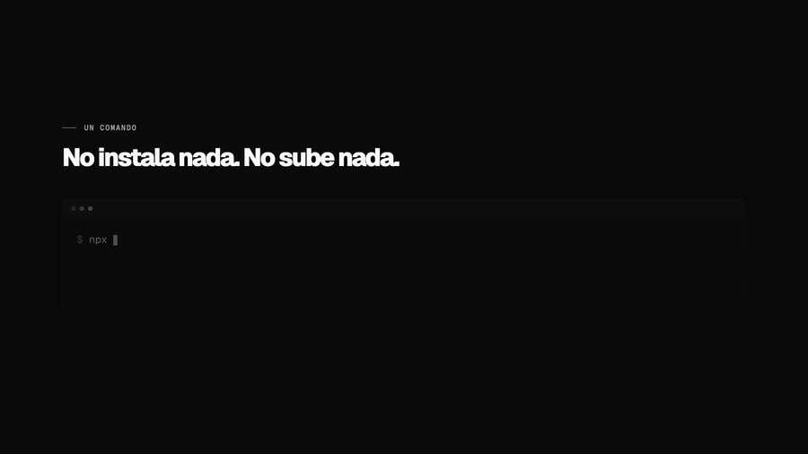
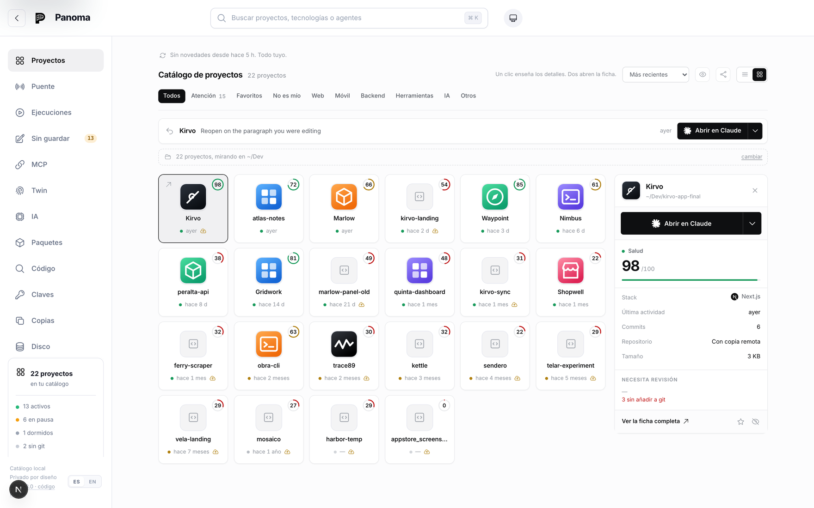

<div align="center">

[Read in English](../README.md)

<picture>
  <source media="(prefers-color-scheme: dark)" srcset="../docs/readme/logo-dark.png">
  
</picture>

# panoma

[](https://github.com/PanomaAI/panoma/actions/workflows/tests.yml)
[](../LICENSE)
[](https://www.npmjs.com/package/panoma)

**El catálogo local de tus proyectos.** Todo lo que construiste —incluido lo que nunca
subiste— listo para retomar, por ti o por tus agentes.



<em>Un comando, sin instalar nada y sin subir nada — y cada proyecto del disco vuelve con
una cara, un nombre y un pulso.</em>

</div>

---

## El mismo disco, dos veces

<div align="center">
  
  <br>
  <em>Lo que te da el disco. Cada una de esas carpetas fue una decisión en su momento.</em>
  <br><br>
  
  <br>
  <em>Lo que hace panoma con él. Las mismas carpetas, el mismo disco, sin subir nada.</em>
</div>

---

`panoma` es un **catálogo local de proyectos** (piénsalo como el App Store de tus propios
proyectos). Le das una carpeta y te devuelve la ficha de cada cosa que vive en tu disco:
pila, dependencias, salud, dónde se distribuye, qué quedó sin subir y qué agente de IA
tocó qué. Las plataformas construyeron torres de control que solo ven sus propios
aviones; panoma ve el cielo entero: tu disco.

La arquitectura, las decisiones de diseño y los límites conocidos de cada pieza se
cuentan más abajo y en [`docs/`](../docs/README.md), que tiene índice. Lo que no está aquí es el plan de negocio:
este repositorio lleva el producto, no la hoja de cálculo.

## Estado

**Local y funcionando de punta a punta** — motor, catálogo, web, CLI, servidor MCP y
despacho de propuestas.

- [x] Motor de detección: npm, pub/Flutter, PyPI, Go, Cargo, RubyGems, Composer
- [x] ~70 reglas de identificación de tecnologías con rastro de evidencia
- [x] Estadísticas de lenguajes, detección de icono, objetivos de distribución
- [x] Puntuación de salud
- [x] Atribución de agentes de IA vía trailers de git
- [x] Detección de familias de copias del mismo proyecto
- [x] CLI `panoma scan`
- [x] Esquema PostgreSQL (Drizzle) + API de ingesta
- [x] Interfaz web tipo App Store
- [x] Últimas versiones desde 7 registros públicos
- [x] Vulnerabilidades vía OSV.dev
- [x] Servidor MCP: contexto, bitácora y cola de tareas para agentes
- [x] Despachar propuestas de actualización verificadas en aislamiento
- [x] Trabajo sin respaldar: sin commitear, sin subir, sin remoto, sin repositorio
- [x] Espacio en disco y qué parte de él se regenera con un comando
- [x] Búsqueda de código en todos los proyectos a la vez
- [x] Credenciales commiteadas (se lee lo que git sigue; buscar en la historia completa, pendiente)
- [x] Recursos y assets que ningún fichero de código menciona
- [x] Cómo se arranca cada proyecto, qué runtime necesita y qué variables le faltan
- [x] Paleta de comandos (⌘K)
- [x] Descripción real de cada proyecto, descartando el texto de plantilla
- [x] De dónde salió: propio, bifurcado, clonado o generado por una plantilla
- [x] Descripción escrita por el modelo que conectes, etiquetada como tal
- [x] El catálogo se mantiene solo: un vigía ve nacer proyectos y re-analiza los que cambian
- [x] El parte del día: qué pasó desde la última vez, con qué agente firmó cada commit
- [x] Interfaz en español e inglés: selector ES·EN, cookie y `Accept-Language` (docs/i18n.md)
- [x] Acceso desde el móvil con credencial: `panoma up --network` (docs/network-access.md)
- [x] El canal de agentes, endurecido: toda puerta con su guarda, la clave en 0600 y el texto ajeno que no puede salirse de su bloque (docs/mcp-security.md)
- [x] El .md de los agentes: linter contra el disco real, bloque que se cuida solo, quién tocó el fichero, los heredados de arriba y la opinión del modelo (docs/agents-md.md)
- [x] Memoria curada por proyecto: los agentes proponen hechos durables, tú apruebas, y lo aprobado llega al primer turno de todos — con presupuesto que se niega a compactar (docs/memory.md)
- [ ] Ejecución en contenedor efímero o CI (hoy: git worktree local)
- [ ] Notificaciones
- [ ] Maven/Gradle y NuGet (vía Syft)

Y la raya que no se mueve: todo lo que este README describe —el motor, el CLI, el
catálogo, el canal de agentes, la memoria— es software libre y lo seguirá siendo. Si
algún día existe una nube alojada, será un servicio comercial aparte construido encima
de este código, no un muro delante de él; que lo libre siga libre es cláusula de
contrato (§4 del [CLA](../CLA.md)), no una entrada de blog.

## Probarlo

Sin instalar nada y sin cuenta. Analiza la carpeta e imprime qué proyecto vive dónde,
cómo arranca cada uno, cuántos commits existen solo en este disco y qué agentes tocaron
cada cosa. Tu código no sale de tu máquina.

```bash
npx panoma scan ~/Desktop
```

## Montarlo desde el código

Hacen falta **Node 22 o superior** y **pnpm**. El suelo es la 22 porque es lo que el CI
mide de verdad: la matriz corre la 22 y la última en los tres sistemas.

```bash
pnpm install
pnpm --filter "./packages/*" build
```

Levantar el catálogo web:

```bash
pnpm --filter @panoma/web run dev
```

Y llenarlo (la web tiene que estar corriendo):

```bash
pnpm exec tsx apps/cli/src/index.ts scan ~/Desktop --save
```

Traer últimas versiones y avisos de seguridad:

```bash
pnpm exec tsx apps/cli/src/index.ts enrich
```

Abre http://localhost:4173.

Escanear es cosa de una vez: a partir de ahí el **vigía** mantiene el catálogo al día.
Vigila cada proyecto (manifiestos, lockfiles, `.env`, la cabeza de git) y las carpetas
donde viven, así que un `git clone` o un `flutter create` junto a tus proyectos entra
solo al catálogo, y un commit re-analiza su ficha. Sin recursividad y sin tocar la red;
estado en `/api/watch`, se apaga con `PANOMA_WATCH=0`.

Se despierta solo: cualquiera que abra panoma lo arma si estaba dormido, al arrancar pone
al día lo que cambió mientras no miraba, cada cinco minutos se comprueba a sí mismo y
cada doce horas trae versiones y avisos nuevos sin que nadie teclee `enrich`.

### El parte del día

Lo primero que se ve al abrir panoma: **qué ha pasado desde la última vez que miraste**.
Commits nuevos —con el agente que los firmó, leído del trailer `Co-Authored-By`—, las
propuestas terminadas que esperan tu decisión, y los proyectos que entraron solos. Nada
de salud, pila ni dependencias: eso se mueve en semanas y ya tiene sus páginas.

La ventana es pegajosa: refrescar no vacía el parte (durante media hora enseña lo mismo)
y volver de vacaciones no vuelca dos semanas de golpe (tope de catorce días).

### Las cuatro preguntas que solo puede contestar un catálogo

Ninguna herramienta que mire un proyecto a la vez puede responder a estas, porque todas
son sobre el conjunto:

```bash
pnpm exec tsx apps/cli/src/index.ts disk               # cuánto disco ocupa y cuánto vuelve solo
pnpm exec tsx apps/cli/src/index.ts search "stripe"    # dónde escribí yo aquello
pnpm exec tsx apps/cli/src/index.ts secrets            # qué claves commiteadas hay en tus repos
pnpm exec tsx apps/cli/src/index.ts describe cabeman   # que el modelo explique de qué trata
```

Las cuatro necesitan la web levantada: el trabajo lo hace el servidor, que es quien
puede escribir en la base de datos. `describe` pide además un modelo conectado
(`panoma ai`). Y `secrets` sale con código distinto de cero cuando encuentra algo,
para que sirva en un gancho de git o en CI.

Sobre el portafolio de referencia (81 proyectos): 48,7 GB regenerables de 56,7 totales,
55 credenciales commiteadas en 14 proyectos, y 56 proyectos con algo sin respaldar —
de los cuales 23 no están bajo control de versiones en absoluto.

### Proponer una actualización

```bash
pnpm exec tsx apps/cli/src/index.ts run <proyecto> <paquete>
```

Aísla el proyecto en un `git worktree`, edita el manifiesto, instala, ejecuta los tests y
deja una rama con el parche. **No aplica el cambio en tu carpeta, no hace push y no abre
ningún PR.** Si el proyecto no tiene tests, la propuesta se marca *sin verificar* en vez
de darse por buena.

### Conectar un agente

```bash
pnpm exec tsx apps/cli/src/index.ts agent-key "Claude Code"
```

Imprime la clave y el bloque MCP listo para pegar; con `--install` lo escribe él, en el
fichero que ese agente lee de verdad —`.mcp.json` del proyecto para Claude Code,
`.cursor/mcp.json` para Cursor— y cuando el formato no es fusionable, como el TOML de
Codex, lo dice y no toca nada. Desde la aplicación es un botón: **Agentes → Conectar**.

Ese fichero lleva la clave en claro, así que se escribe en 0600 y panoma avisa si git se
lo llevaría. Qué protege cada puerta del canal —y qué no protege ninguna— está en
[docs/mcp-security.md](../docs/mcp-security.md).

Hay que reiniciar el agente después. A partir de ahí dispone de nueve herramientas:

| Herramienta | Para qué |
|---|---|
| `panoma_context` | el parte: pila, dependencias atrasadas, vulnerabilidades, tareas y qué hicieron otros agentes |
| `panoma_log` | registrar un cambio, una decisión o un bloqueo |
| `panoma_remember` | **proponer** un hecho durable para la memoria del proyecto. No se sirve a nadie hasta que lo apruebas tú |
| `panoma_recall` | buscar en la bitácora entera, no solo en la ventana reciente |
| `panoma_ask` | dejarle una pregunta de criterio a tu doble en vez de interrumpirte |
| `panoma_tasks` | ver la cola del proyecto, abierta y cerrada |
| `panoma_create_task` | anotar deuda técnica sin salirse de lo que está haciendo |
| `panoma_claim_task` | coger una tarea sin pisarse con otro agente |
| `panoma_complete_task` | cerrarla explicando cómo |

El contrato de cada una está en [docs/agent-channel.md](../docs/agent-channel.md).

Analizar un proyecto:

```bash
pnpm exec tsx apps/cli/src/index.ts scan .
```

Encontrar y analizar todo lo que haya bajo una carpeta:

```bash
pnpm exec tsx apps/cli/src/index.ts scan ~/Desktop
```

Ficha completa con dependencias y desglose de salud:

```bash
pnpm exec tsx apps/cli/src/index.ts scan ~/mi-proyecto -v
```

Encontrar copias del mismo proyecto y saber cuál es la versión viva:

```bash
pnpm exec tsx apps/cli/src/index.ts scan ~/Desktop -d
```

Exportar el portafolio entero a JSON:

```bash
pnpm exec tsx apps/cli/src/index.ts scan ~/Desktop --json --out portafolio.json
```

## Estructura

```
packages/core/     motor de detección (TypeScript puro, sin red)
  discover.ts      recorrido del árbol, respeta .gitignore, encuentra raíces de proyecto
  ecosystems/      parsers de manifiestos y lockfiles por ecosistema
  rules.ts         catálogo declarativo de reglas de identificación
  fingerprint.ts   evaluador de reglas con acumulación de confianza
  languages.ts     reparto de lenguajes por bytes
  icon.ts          búsqueda del icono de la app
  health.ts        puntuación de salud 0-100
  git.ts           metadatos de git, atribución de agentes y trabajo sin respaldar
  duplicates.ts    agrupación de copias del mismo proyecto
  links.ts         enlaces al panel de cada servicio que usa el proyecto
  runbook.ts       cómo se instala, se arranca y qué runtime necesita
  assets.ts        recursos que ningún fichero de código menciona
  disk.ts          ocupación en disco y qué parte se regenera con un comando
  secrets.ts       credenciales commiteadas en los ficheros que git sigue
  analyze.ts       orquestador del pipeline

packages/db/       esquema PostgreSQL (Drizzle), ingesta y consultas
  schema.ts        tablas; snapshots append-only, ids deterministas
  ingest.ts        volcado idempotente de un escaneo
  queries.ts       lecturas del catálogo
  client.ts        driver: PGlite en local, postgres-js con DATABASE_URL

packages/enrich/   datos que necesitan red
  registries.ts    npm, pub, PyPI, crates.io, Go, RubyGems, Packagist
  osv.ts           vulnerabilidades desde OSV.dev
  versions.ts      comparación de versiones tolerante entre ecosistemas
  refresh.ts       orquestación y recálculo de salud

packages/runner/   despachador de tareas acotadas
  worktree.ts      aislamiento con git worktree
  detect.ts        cómo se instala y se prueba este proyecto
  recipes/bump.ts  edición dirigida del manifiesto, preservando el formato
  execute.ts       orquestación: editar → instalar → verificar → proponer

packages/ai/       conexión con los modelos
  providers.ts     los proveedores: clave propia o delegar en un agente ya instalado
  credentials.ts   ~/.panoma/ai.json en 0600, escritura atómica
  cli-agent.ts     hablar con un agente de terminal que ya esté instalado
  complete.ts      la llamada, con su presupuesto y su tope

packages/mcp/      servidor MCP — el puente con los agentes
  client.ts        cliente HTTP del catálogo + detección de proyecto
  format.ts        respuestas en texto legible para un modelo
  index.ts         definición de las nueve herramientas

apps/cli/          CLI: scan, enrich, disk, search, secrets, run, ai
apps/web/          catálogo web (Next.js 15) — solo local, nunca se despliega
apps/site/         el sitio público: la landing y /docs (Next.js 15)
```

## Principios de diseño

**El motor no hace red.** Todo lo que necesita internet (últimas versiones, vulnerabilidades
de OSV) se añade *encima* del `ProjectAnalysis`, nunca dentro. Eso lo mantiene rápido,
determinista y trivial de testear.

**Nunca sube tu código.** El escaneo es local y solo produce metadatos. Es una promesa de
producto, no un detalle de implementación: sin ella nadie apunta la herramienta a sus repos
privados.

**Toda detección guarda su evidencia.** Cuando el motor dice "esto es Flutter", puede explicar
por qué (`flutter en pubspec.yaml`, peso 0.7). Cuando se equivoque, el usuario ve el motivo
y puede corregirlo.

**La web es la única dueña de la base de datos.** El CLI no escribe en ella: envía el
análisis a `/api/ingest`. PGlite admite un solo proceso y dos escritores corrompen el
directorio de datos — literalmente: ha pasado dos veces, y en
[docs/broken-catalog.md](../docs/broken-catalog.md) está cómo se reconoce y cómo se recupera. Además es como tiene que funcionar en producción de todos modos —
las credenciales de la base nunca deberían estar en la máquina de cada usuario.

**El mismo SQL en local y en producción.** Sin `DATABASE_URL` se usa PGlite (PostgreSQL
compilado a WASM, sin Docker ni servidor); con `DATABASE_URL` se usa Supabase. Mismo
dialecto, mismas consultas, solo cambia el driver.

**Decir con qué aislamiento se ejecutó algo.** Una propuesta verificada dentro de un
contenedor merece más confianza que una verificada en el anfitrión. Presentarlas igual
escondería justo la diferencia que importa, así que el nivel se guarda por ejecución y se
muestra siempre — incluido cuando es el más bajo.

**Agregar, no reimplementar.** panoma no es un escáner de vulnerabilidades, ni un CI, ni un
gestor de paquetes. Su valor es la vista unificada del portafolio: las vulnerabilidades
vienen de OSV.dev y las versiones de los registros oficiales; lo que panoma aporta es
cruzarlas con todo lo que has construido.

**Una propuesta, nunca un cambio aplicado.** El despachador termina en una rama con un
parche. No toca tu árbol de trabajo, no hace push y no abre PRs: publicar es una decisión
humana que requiere mirar el diff. Y solo hay una receta —subir una dependencia— porque es
acotada, medible por los tests del propio proyecto y reversible.

**«Sin verificar» y «correcto» no son lo mismo.** Si el proyecto no tiene tests, la
propuesta lo dice en lugar de presentarse como comprobada. Un verificador que aprueba lo
que no ha podido verificar no sirve para nada.

**El contexto primero, el registro después.** `panoma_context` existe para darle al agente
algo que no tenía; `panoma_log` es el peaje que se paga a cambio. Una herramienta que solo
pide informes no la instala nadie, y sin instalación no hay registro.

**El registro no puede depender de la buena voluntad del agente.** Por eso la atribución
por trailers `Co-Authored-By` de git funciona en paralelo, en cualquier repositorio, de
forma retroactiva y sin instalar nada. MCP añade profundidad; git garantiza cobertura.

**Un hueco honesto antes que un dato inventado.** Si un registro no publica algo —la
gravedad de un aviso, la versión de una dependencia del SDK— se muestra vacío. Un dato
plausible pero falso es peor que ninguno: `flutter: sdk: flutter` no es un paquete de
pub.dev, y consultarlo devolvía la versión de otro paquete abandonado con el mismo nombre.

## Aislamiento de las propuestas

El worktree aísla **los cambios**: nada toca tu carpeta. Pero los comandos se ejecutan en
algún sitio, y un `postinstall` de una dependencia corre con los permisos de quien lo
lanza. Por eso hay tres niveles, y cada ejecución guarda con cuál corrió:

| nivel | protege | coste |
|---|---|---|
| `local` | nada más que los cambios | ninguno |
| `hardened` *(por defecto)* | credenciales y el resto de tu disco | instalaciones más lentas |
| `container` | además red, procesos y recursos | necesita Docker o Podman |

Medido con un script que imita a un `postinstall` hostil, no supuesto:

| | secretos en el entorno | lee `~/.ssh` | ve el resto de tu disco | red en los tests |
|---|---|---|---|---|
| `local` | **7** | sí | sí | sí |
| `hardened` | 0 | no | **sí** | sí |
| `container` | 0 | no | **no** | **no** |

La fila que más cuesta ver es la de en medio: **`hardened` sigue dejando que un script lea
todos tus demás proyectos.** Protege credenciales, no ficheros. Solo el contenedor monta
únicamente el worktree, así que el resto del disco no existe para el proceso.

En el contenedor, el paso de instalación tiene red —la necesita para el registro— y el de
tests no: se desconecta antes de ejecutarlos. Un `postinstall` malicioso se ejecuta con red
de todos modos; lo que se cierra es la vía de exfiltración durante los tests.

### Usar el nivel `container`

```bash
brew install colima docker
colima start --cpu 2 --memory 4 --disk 12
panoma run <proyecto> <paquete> --isolation container
```

Los worktrees se crean en `~/.panoma/work` y no en el temporal del sistema porque en macOS
`os.tmpdir()` devuelve `/var/folders/…`, que las VM de contenedores **no montan**: un
worktree ahí es invisible dentro del contenedor.

Si se pide `container` y no hay runtime, **se degrada a `hardened` y se dice por qué**.
Degradar en silencio marcaría la ejecución con un aislamiento que no tuvo.

## Contribuir

Las incidencias y los pull requests son bienvenidos. La guía canónica está en inglés en
[`CONTRIBUTING.md`](../CONTRIBUTING.md), con
[traducción al castellano](CONTRIBUTING.es.md). Ayuda a buscar antes de empezar,
elegir la pieza correcta, montar el proyecto y dejar la evidencia que necesita la revisión.
También explica el [acuerdo de colaboración](../CLA.md) que se firma antes de la primera
aportación.

## Licencia

**AGPL-3.0-only.** Copyright (C) 2026 Jesus Castillo. El texto completo está en
[`LICENSE`](../LICENSE).

Es la licencia que corresponde a lo que panoma promete. Este programa lee tu disco entero
—incluidos los `.env` que git ignora— y te dice a la cara que nada de eso sale de tu
máquina. Con el código cerrado esa frase hay que creérsela; con el código abierto se
comprueba. La cláusula de red de la AGPL cierra el hueco que dejaría la GPL: un tercero que ofrezca
panoma como servicio tiene que publicar sus cambios, en vez de quedárselos. El titular
puede además licenciar este mismo código bajo otros términos —para eso existe el
[CLA](../CLA.md), y su §4 fija lo que nunca puede salir del común.

Las licencias del código de terceros que viaja dentro del paquete están en el
`THIRD-PARTY-NOTICES.md` que genera la construcción.
